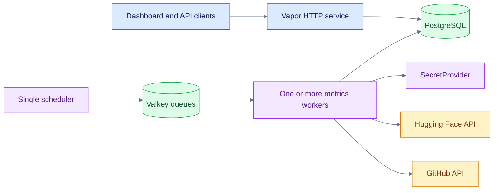
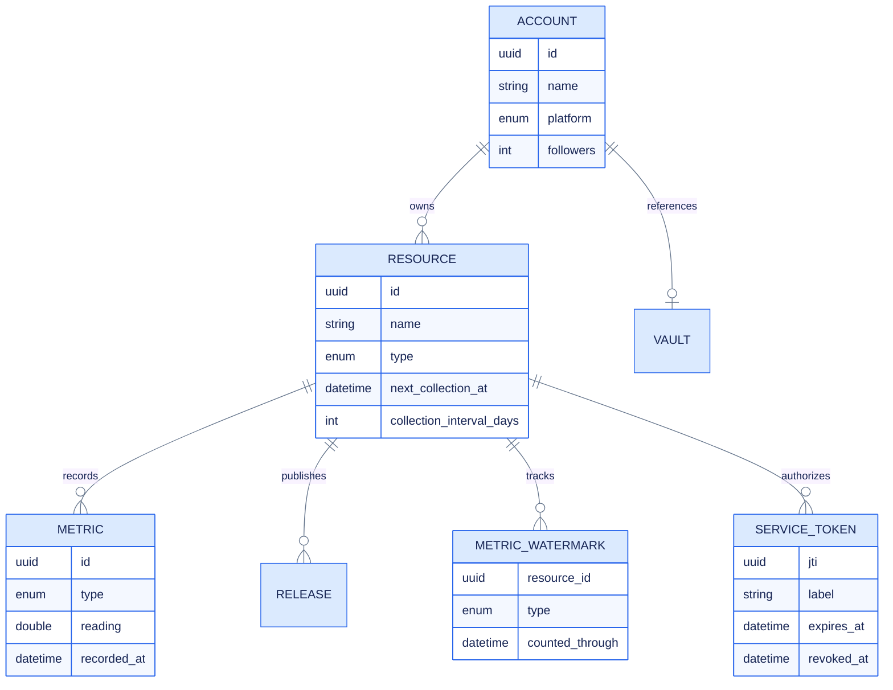

<div align="center">
  <picture>
    <source media="(prefers-color-scheme: dark)" srcset="assets/logo-dark.svg">
    <source media="(prefers-color-scheme: light)" srcset="assets/logo-light.svg">
    
  </picture>

  <p><strong>Open-source impact, measured across platforms.</strong></p>

  <p>
    A Swift Vapor service that collects ecosystem signals, preserves trustworthy historical
    totals, and publishes them through a documented API and live dashboard.
  </p>

  <p>
    
    
    
    
    
  </p>

  <p>
    <a href="#quick-start">Quick start</a> ·
    <a href="#architecture">Architecture</a> ·
    <a href="#authentication">Authentication</a> ·
    <a href="#configuration">Configuration</a> ·
    <a href="#documentation">Documentation</a>
  </p>
</div>

---

## Overview

**ICICLE Insights** collects popularity and usage metrics for open-source accounts and the
resources they publish—repositories, models, datasets, packages, images, and services. It turns
those readings into a historical REST API and interactive dashboard.

Built for the [ICICLE](https://icicle.osu.edu/) research ecosystem, its platform-neutral data
model and modular collection pipeline can support any community that wants a clearer picture of
its open-source impact.

### Why it exists

- **One view across platforms** — accounts, repositories, models, datasets, packages, and images
  share a consistent metric model.
- **Correct rolling totals** — daily watermarks prevent overlapping API windows from being
  counted twice.
- **Pluggable credential storage** — jobs resolve provider tokens through a small
  `SecretProvider` contract instead of coupling collection logic to one backend.
- **Durable asynchronous collection** — Valkey stores work while stateless workers scale
  independently from the HTTP service and scheduler.
- **Public by default, guarded where it matters** — reads need no credential; every write does.

<div align="center">
  
</div>

## Architecture



| Component | Purpose | Scaling rule |
|---|---|---|
| HTTP service | Dashboard, REST API, OpenAPI | Scale horizontally |
| PostgreSQL | Accounts, resources, metric series, watermarks | One managed database or HA cluster |
| Valkey/Redis | Queue storage and rate-limit counters | One shared service or managed deployment |
| Scheduler | Evaluates every registered clock | **Exactly one replica** |
| Queue worker | Claims and executes jobs from `metrics` | Scale horizontally |

Queue workers use atomic claims, so several consumers can drain the same queue. Delivery is
still at-least-once; jobs must remain retry-safe. The scheduler stays single-replica to prevent
the same scheduled work from being dispatched twice.

## Collection status

| Platform | Current collection | Schedule | Status |
|---|---|---|---|
| GitHub repositories | Stars, forks, subscribers, clones, views | Per-resource interval; hourly due scan | Active |
| GitHub accounts | Organization followers | Monthly, first day at 03:00 | Active |
| Hugging Face | Likes, rolling downloads, lifetime downloads | Per-resource interval; hourly due scan | Active |
| GHCR | HTML scraping prototype | Not scheduled | In development |
| npm | — | Not scheduled | Planned |
| PyPI | — | Not scheduled | Planned |

The hourly scan does not call every platform hourly. Each resource has a
`nextCollectionAt` value and a configurable interval, defaulting to seven days. See
[queue workers and scheduling](docs/queue-workers.md) for the complete matrix.

## Quick start

### Requirements

- Swift 6.3+
- PostgreSQL
- Valkey or Redis
- [`just`](https://just.systems/)
- Credentials for the selected secret provider

```bash
cp .env.example .env
```

Fill in at minimum:

```dotenv
TAPIS_BASE_URL=https://icicleai.staging.tapis.io/v3
TAPIS_TENANT=icicleai
TAPIS_USER=your-service-user
TAPIS_TOKEN=replace-me
ROOT_ADMIN_USERNAME=your-tapis-username
DATABASE_TLS=disable
```

> **Use the staging tenant for local work.** It is a separate vault, so nothing you do locally
> touches production credentials. `TAPIS_BASE_URL` and `TAPIS_TENANT` must name the *same* tenant —
> each has its own host — and the `/v3` suffix is required. Getting this pair wrong boots cleanly
> and then refuses every admin with a bare 403.

Keep `.env` out of version control; it is already gitignored.

### Native Swift development

Run PostgreSQL and Valkey locally, then:

```bash
just migrate
swift run Insights service-token init-key   # once per deployment, before minting tokens
just run
```

Open:

- Dashboard: <http://127.0.0.1:8080/>
- API reference: <http://127.0.0.1:8080/docs>
- OpenAPI JSON: <http://127.0.0.1:8080/openapi.json>
- Health: <http://127.0.0.1:8080/health> and `/ready`

### Apple Container (macOS 26+)

Apple Container settings for local services live in `.env.container`; credentials remain in
`.env`. BuildKit is started with four CPUs and 8 GiB of memory by the included recipes.

```bash
just dns              # once, before the first stack run; needs an administrator password
just stack-scheduled  # db, valkey, migrate, app, queue worker, scheduler
just stop             # remove stack containers; preserve data volumes
just clean            # also remove the project network; preserve data volumes
```

### Docker Compose

```bash
docker compose build
docker compose up db valkey -d
docker compose run --rm migrate
docker compose up app queues scheduled
```

Scale only the queue drainer when more collection throughput is needed:

```bash
docker compose up --scale queues=2 app queues scheduled
```

Do not scale `scheduled` above one replica.

## Authentication

Reads are public. Writes are guarded, and two kinds of caller can authenticate:

| Caller | Credential | May do |
|---|---|---|
| A person on the dashboard | Tapis JWT, sent as `Authorization: Bearer` | Everything, if an admin |
| A deployed service | Webhook token this server minted | Post metrics for exactly one resource |

Tapis tokens are verified locally against the tenant public key fetched at boot, so no request
makes a round trip to Tapis. Admins are `ROOT_ADMIN_USERNAME` plus an `admins` table managed from
the dashboard.

Webhook tokens are scoped to a single resource inside the signature, expire at 90 days, and are
revocable immediately. Rotate signing keys without downtime:

```bash
swift run Insights service-token issue --resource <uuid> --label prod-inference
swift run Insights service-token list
swift run Insights service-token revoke --jti <uuid>
swift run Insights service-token rotate-key    # additive; issued tokens keep working
```

Full detail in [API authentication](docs/api-authentication.md).

## Configuration

| Variable | Required | Description |
|---|---:|---|
| `SECRET_PROVIDER` | No | Credential backend; defaults to `tapis` |
| `TAPIS_BASE_URL` | Yes | Tenant base URL **including `/v3`** |
| `TAPIS_TENANT` | Yes | Tenant ID; must match the host above |
| `TAPIS_USER` | Yes | Service username; scopes the vault path |
| `TAPIS_TOKEN` | Yes | Service access token; treat as a secret |
| `ROOT_ADMIN_USERNAME` | Yes | Break-glass admin. Boot fails when empty |
| `TOKEN_SIGNING_SECRET` | No | Vault secret holding the webhook keyset |
| `CORS_ORIGINS` | No | Comma-separated allowlist; unset installs no CORS middleware |
| `FRAME_ANCESTORS` | No | Origins permitted to iframe the dashboard; unset denies framing |
| `RATE_LIMIT_PER_MINUTE` | No | Per client IP across `/api`. Default 300 |
| `WEBHOOK_RATE_LIMIT_PER_MINUTE` | No | Per token on the webhook route. Default 60 |
| `SLACK_WEBHOOK_URL` | No | Collection failure alerts; unset logs only |
| `SLACK_WEBHOOK_URL_WARNINGS` | No | Optional second channel for lower-severity failures |
| `DATABASE_HOST` | Deployment | Defaults to `localhost` natively |
| `DATABASE_PORT` | No | Defaults to `5432` |
| `DATABASE_NAME` | No | Production `vapor_database`; development `dev`; tests `test` |
| `DATABASE_USERNAME` | No | Defaults to `vapor_username` |
| `DATABASE_PASSWORD` | No | Defaults to `vapor_password`; replace in deployments |
| `DATABASE_TLS` | No | Set `disable` only for the local stock PostgreSQL container |
| `REDIS_HOST` | Deployment | Defaults to `localhost` natively |
| `REDIS_PORT` | No | Defaults to `6379` |
| `REDIS_PASSWORD` | No | Empty for the local unauthenticated Valkey service |
| `LOG_LEVEL` | No | `trace` through `critical` |

`configure.swift` validates these at startup and logs the resolved values, so a misconfiguration
is visible in the first lines of output rather than as a 403 three days later.

## Secret-provider integration

Platform credentials flow through `SecretProvider`, a focused interface for reading, writing,
and destroying named secrets. Collection code uses this stable application service while the
composition root selects its adapter.

`TapisClient.Vaults` provides the first adapter. Additional backends—HashiCorp Vault, cloud
secret managers, Kubernetes Secrets—can implement the same interface and participate through the
application composition root.

1. Configure the `TAPIS_*` variables for a dedicated service identity with minimum Vault
   permissions.
2. Create provider tokens in Tapis Vault and store only their names in Insights metadata.
3. Never log resolved `Secret` values; the wrapper redacts descriptions and reflection output.

The bundled July 2026 snapshot is ICICLE-specific and only loads in development.

## Data model



Watermarks are per resource and metric type. They record the newest completed daily value
already folded into an all-time total, preventing overlapping rolling windows from being added
twice. Read [Metric watermarks](docs/watermarks.md) for a visual explanation.

## API and dashboard

The generated OpenAPI document at `/docs` is the source of truth for enabled routes. Guarded
routes carry the bearer scheme in the document.

All JSON timestamps use ISO 8601. `/api/metrics` supports `resourceID`, `type`, and `limit`
filters and returns newest readings first. Every response carries an `X-Request-ID` header, which
is worth quoting in a bug report.

<div align="center">
  
</div>

## Development

```bash
just test       # serial test suite against the dedicated test database
just fmt        # format Swift sources and Package.swift
just fmt-check  # verify formatting without writing
just build      # build the Apple Container application image
```

`.env` must exist and set `DATABASE_TLS=disable` locally, or the entire suite fails during setup
rather than in one test. See the [test reference](docs/testing.md).

```text
Sources/Insights/
├── Commands/       one-shot operator commands
├── Controllers/    HTTP boundaries and health probes
├── DTOs/           request and response types
├── Middlewares/    authenticators, requirements, limits, headers
├── Migrations/     schema and development snapshot
├── Models/         Fluent models
├── Queues/         scheduled dispatchers, workers, and metric folds
├── Services/
│   ├── Admins/         who holds administrative access
│   ├── Notifications/  failure alerting
│   ├── Secrets/        provider-neutral credential contract
│   ├── ServiceTokens/  webhook token issuing and signing keys
│   └── Tapis/          Tapis Vault adapter
└── configure.swift
```

## Documentation

- [Introduction](docs/introduction.md) — visual orientation and recommended learning paths
- [Developer handbook](docs/README.md) — documentation map and reading order
- [Architecture](docs/architecture.md) — components, lifecycles, and layout
- [System invariants](docs/invariants.md) — correctness rules every change must preserve
- [API authentication](docs/api-authentication.md) — credentials, admins, webhook tokens
- [Test reference](docs/testing.md) — what the suite covers and why it might not run
- [Secret providers](docs/secret-providers.md) — configure, implement, test, and migrate adapters
- [Metric collection](docs/collection.md) — snapshots, rolling windows, and retention
- [Metric watermarks](docs/watermarks.md) — why overlapping daily windows need a bookmark
- [Adding a job](docs/jobs.md) — registration, routing, metrics, and tests
- [Queue workers and scheduling](docs/queue-workers.md) — schedules, scaling, and the job matrix
- [Testing collection](docs/testing-collection.md) — one-shot commands and watermark behavior
- [Troubleshooting](docs/troubleshooting.md) and [glossary](docs/glossary.md)

## Deploying

Before a public deployment: set `ROOT_ADMIN_USERNAME`, run `service-token init-key` against the
production vault (staging's keyset does not carry over), point `FRAME_ANCESTORS` at any embedding
origin, enable verified TLS, configure backups, and wire `/health` and `/ready` into your
orchestrator. Monitor scheduler liveness, queue depth, job failures, and provider rate limits.

## License

GNU General Public License v3.0. See [LICENSE](LICENSE).

## Acknowledgments

Developed as part of the
[ICICLE (Intelligent Cyberinfrastructure with Computational Learning in the Environment)](https://icicle.osu.edu/)
initiative.
