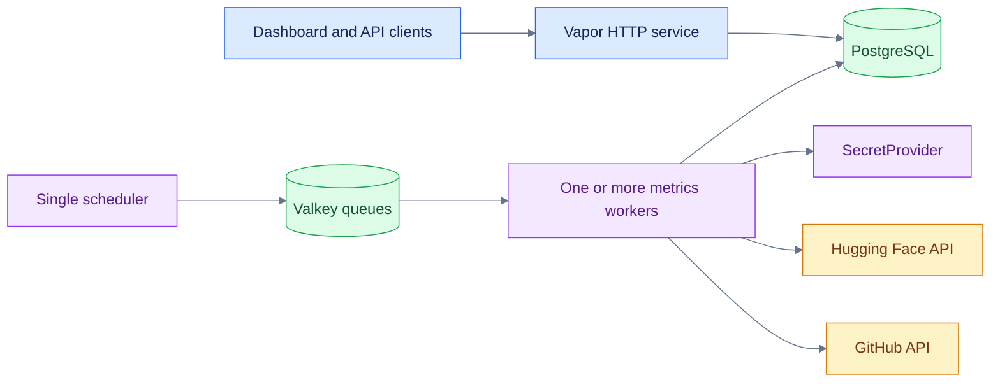
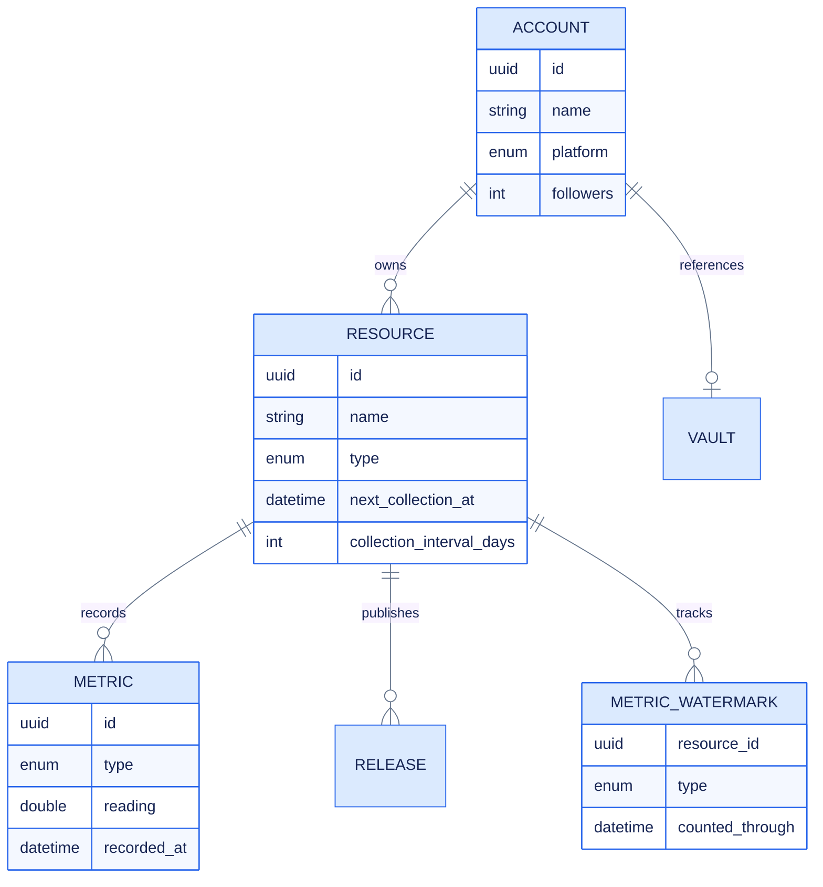

<div align="center">
  <picture>
    <source media="(prefers-color-scheme: dark)" srcset="assets/logo-dark.svg">
    <source media="(prefers-color-scheme: light)" srcset="assets/logo-light.svg">
    
  </picture>

  <p><strong>Open-source impact, measured across platforms.</strong></p>

  <p>
    A Swift Vapor service that collects ecosystem signals, preserves trustworthy historical
    totals, and publishes them through a documented API and live dashboard.
  </p>

  <p>
    
    
    
    
    
  </p>

  <p>
    <a href="#quick-start">Quick start</a> ·
    <a href="#architecture">Architecture</a> ·
    <a href="#collection-status">Collection status</a> ·
    <a href="#secret-provider-integration">Secret providers</a> ·
    <a href="#documentation">Documentation</a>
  </p>
</div>

---

## Overview

**ICICLE Insights** collects popularity and usage metrics for open-source accounts and the
resources they publish—repositories, models, datasets, packages, images, and services. It turns
those readings into a historical REST API and interactive dashboard.

Built for the [ICICLE](https://icicle.osu.edu/) research ecosystem, its platform-neutral data
model and modular collection pipeline can support any community that wants a clearer picture of
its open-source impact.

### Why it exists

- **One view across platforms** — accounts, repositories, models, datasets, packages, and images
  share a consistent metric model.
- **Correct rolling totals** — daily watermarks prevent overlapping API windows from being
  counted twice.
- **Pluggable credential storage** — jobs resolve provider tokens through a small
  `SecretProvider` contract instead of coupling collection logic to one backend.
- **Durable asynchronous collection** — Valkey stores work while stateless workers scale
  independently from the HTTP service and scheduler.
- **Portable operations** — run with Docker Compose or Apple's Container CLI on macOS 26+.

<div align="center">
  
</div>

## Architecture



| Component | Purpose | Scaling rule |
|---|---|---|
| HTTP service | Dashboard, REST API, OpenAPI | Scale horizontally |
| PostgreSQL | Accounts, resources, metric series, watermarks | One managed database or HA cluster |
| Valkey/Redis | Durable queue storage | One shared service or managed deployment |
| Scheduler | Evaluates every registered clock | **Exactly one replica** |
| Queue worker | Claims and executes jobs from `metrics` | Scale horizontally |

Queue workers use atomic claims, so several consumers can drain the same queue. Delivery is
still at-least-once; jobs must remain retry-safe. The scheduler stays single-replica to prevent
the same scheduled work from being dispatched twice.

## Collection status

| Platform | Current collection | Schedule | Status |
|---|---|---|---|
| GitHub repositories | Stars, forks, subscribers, clones, views | Per-resource interval; hourly due scan | Active |
| GitHub accounts | Organization followers | Monthly, first day at 03:00 | Active |
| Hugging Face | Likes, rolling downloads, lifetime downloads | Per-resource interval; hourly due scan | Active |
| GHCR | HTML scraping prototype | Not scheduled | In development |
| npm | — | Not scheduled | Planned |
| PyPI | — | Not scheduled | Planned |

The hourly scan does not call every platform hourly. Each resource has a
`nextCollectionAt` value and a configurable interval, defaulting to seven days. See
[queue workers and scheduling](docs/queue-workers.md) for the complete matrix.

## Quick start

### Requirements

- Swift 6.3+
- PostgreSQL
- Valkey or Redis
- [`just`](https://just.systems/)
- Credentials for the selected secret provider

Copy the example configuration and fill in the settings for your selected provider:

```bash
cp .env.example .env
```

```dotenv
SECRET_PROVIDER=tapis
TAPIS_BASE_URL=https://example.tapis.io
TAPIS_TENANT=example
TAPIS_USER=your-service-user
TAPIS_TOKEN=replace-me
```

When `SECRET_PROVIDER=tapis`, `TAPIS_TOKEN` authenticates the service identity used to read
platform credentials. Keep `.env` out of version control.

### Apple Container (macOS 26+)

Apple Container settings for local services live in `.env.container`; secret-provider
credentials remain in `.env`. BuildKit is started with four CPUs and 8 GiB of memory by the
included recipes.

```bash
just stack
```

This creates the network and persistent volumes, starts PostgreSQL and Valkey, applies
migrations, and launches the HTTP service, metrics worker, and single scheduler.

```bash
just stop     # remove stack containers; preserve data volumes
just clean    # also remove the project network; preserve data volumes
```

### Docker Compose

```bash
docker compose build
docker compose up db valkey -d
docker compose run --rm migrate
docker compose up app queues scheduled
```

Scale only the queue drainer when more collection throughput is needed:

```bash
docker compose up --scale queues=2 app queues scheduled
```

Do not scale `scheduled` above one replica.

### Native Swift development

Run PostgreSQL and Valkey locally, then:

```bash
just migrate
just run
```

Open:

- Dashboard: <http://127.0.0.1:8080/dashboard>
- API reference: <http://127.0.0.1:8080/docs>
- OpenAPI JSON: <http://127.0.0.1:8080/openapi.json>

## Configuration

| Variable | Required | Description |
|---|---:|---|
| `SECRET_PROVIDER` | No | Credential backend; defaults to the currently supported `tapis` adapter |
| `TAPIS_BASE_URL` | When `tapis` is selected | Tapis base URL, for example `https://example.tapis.io` |
| `TAPIS_TENANT` | When `tapis` is selected | Tapis tenant identifier |
| `TAPIS_USER` | When `tapis` is selected | Service username used for Vault calls |
| `TAPIS_TOKEN` | When `tapis` is selected | Service access token; treat as a secret |
| `DATABASE_HOST` | Deployment | PostgreSQL hostname; defaults to `localhost` natively |
| `DATABASE_PORT` | No | Defaults to `5432` |
| `DATABASE_NAME` | No | Production defaults to `vapor_database`; development uses `dev`; tests use `test` |
| `DATABASE_USERNAME` | No | Defaults to `vapor_username` |
| `DATABASE_PASSWORD` | No | Defaults to `vapor_password`; replace in deployments |
| `DATABASE_TLS` | No | Set `disable` only for the local stock PostgreSQL container |
| `REDIS_HOST` | Deployment | Valkey/Redis hostname; defaults to `localhost` natively |
| `REDIS_PORT` | No | Defaults to `6379` |
| `REDIS_PASSWORD` | No | Empty for the local unauthenticated Valkey service |
| `LOG_LEVEL` | No | `trace`, `debug`, `info`, `notice`, `warning`, `error`, or `critical` |

`configure.swift` selects and validates the secret adapter during application startup. The
`tapis` adapter requires all four `TAPIS_*` values.

## Secret-provider integration

Platform credentials flow through `SecretProvider`, a focused interface for reading, writing,
and destroying named secrets. Collection code uses this stable application service while the
composition root selects its adapter.

`TapisClient.Vaults` provides the first adapter. Additional backends—such as HashiCorp Vault,
cloud secret managers, or Kubernetes Secrets—can implement the same interface and participate
through the application composition root.

With the current Tapis adapter:

1. Configure the four `TAPIS_*` variables for a dedicated service identity with minimum Vault
   permissions.
2. Create provider tokens in Tapis Vault and store only their names in Insights metadata.
3. Never log resolved `Secret` values; the wrapper redacts descriptions and reflection output.

The bundled July 2026 snapshot is ICICLE-specific and only loads in development. Any deployment
can replace it with its own account/resource onboarding flow independently of the secret backend.

## Data model



Watermarks are per resource and metric type. They record the newest completed daily value
already folded into an all-time total, preventing overlapping rolling windows from being added
twice. Read [Metric watermarks](docs/watermarks.md) for a visual explanation.

## API and dashboard

The generated OpenAPI document at `/docs` is the source of truth for enabled routes. Current
public functionality includes collection endpoints, account update/delete handlers, resource
views, metric queries, the dashboard, and OpenAPI output. Several mutation routes are
intentionally disabled until authentication and authorization are implemented.

All JSON timestamps use ISO 8601. `/metrics` supports `resourceID`, `type`, and `limit` filters
and returns newest readings first.

<div align="center">
  
</div>

## Development

```bash
just test       # serial test suite against the dedicated test database
just fmt        # format Swift sources and Package.swift
just fmt-check  # verify formatting without writing
just build      # build the Apple Container application image
```

The main implementation lives under `Sources/Insights`:

```text
Sources/Insights/
├── Controllers/   HTTP and dashboard routes
├── DTOs/          request and response types
├── Migrations/    schema and development snapshot
├── Models/        Fluent models
├── Queues/        scheduled dispatchers, workers, and metric folds
├── Services/
│   ├── Secrets/   provider-neutral credential contract and redacted value
│   └── Tapis/     current Tapis Vault adapter
└── configure.swift
```

## Documentation

- [Introduction](docs/introduction.md) — visual orientation and recommended learning paths
- [Developer handbook](docs/README.md) — documentation map and recommended reading order
- [Architecture](docs/architecture.md) — components, responsibilities, lifecycles, and layout
- [System invariants](docs/invariants.md) — correctness rules every change must preserve
- [Secret providers](docs/secret-providers.md) — configure, implement, test, and migrate adapters
- [Metric collection](docs/collection.md) — snapshots, rolling windows, and retention
- [Metric watermarks](docs/watermarks.md) — why overlapping daily windows need a bookmark
- [Adding a job](docs/jobs.md) — registration, routing, metrics, and tests
- [Queue workers and scheduling](docs/queue-workers.md) — schedules, scaling, containers, and
  the current job matrix
- [Testing collection](docs/testing-collection.md) — one-shot commands, database effects, logs,
  and watermark behavior
- [Troubleshooting](docs/troubleshooting.md) and [glossary](docs/glossary.md)

## Security and production readiness

The included Compose file and Apple Container recipes are local-development tooling. Before a
public deployment, add authentication and authorization, rotate service tokens,
use managed secrets, enable verified TLS, restrict network exposure, configure backups, and
monitor scheduler, queue depth, job failures, and provider rate limits.

## License

GNU General Public License v3.0. See [LICENSE](LICENSE).

## Acknowledgments

Developed as part of the
[ICICLE (Intelligent Cyberinfrastructure with Computational Learning in the Environment)](https://icicle.osu.edu/)
initiative.
