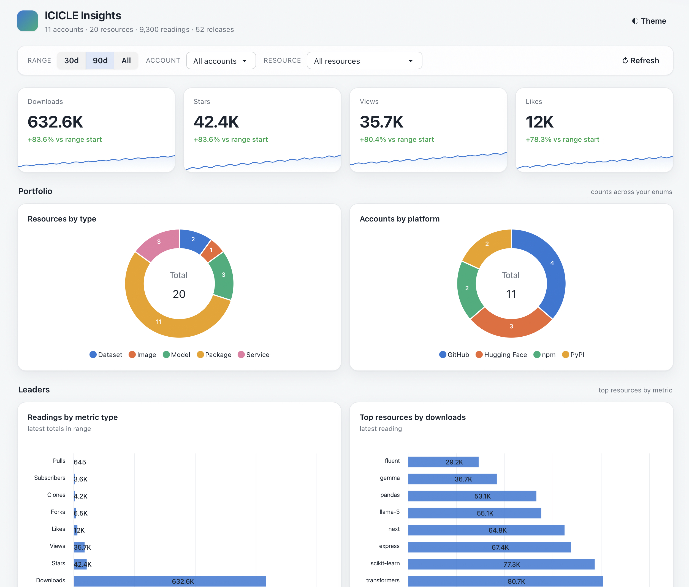
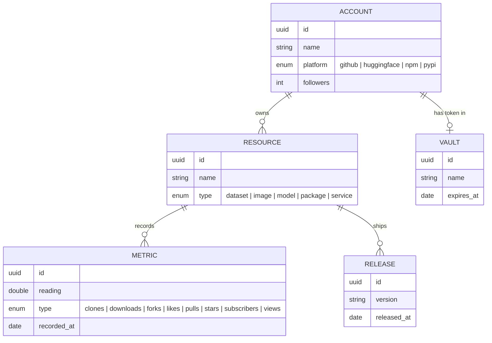
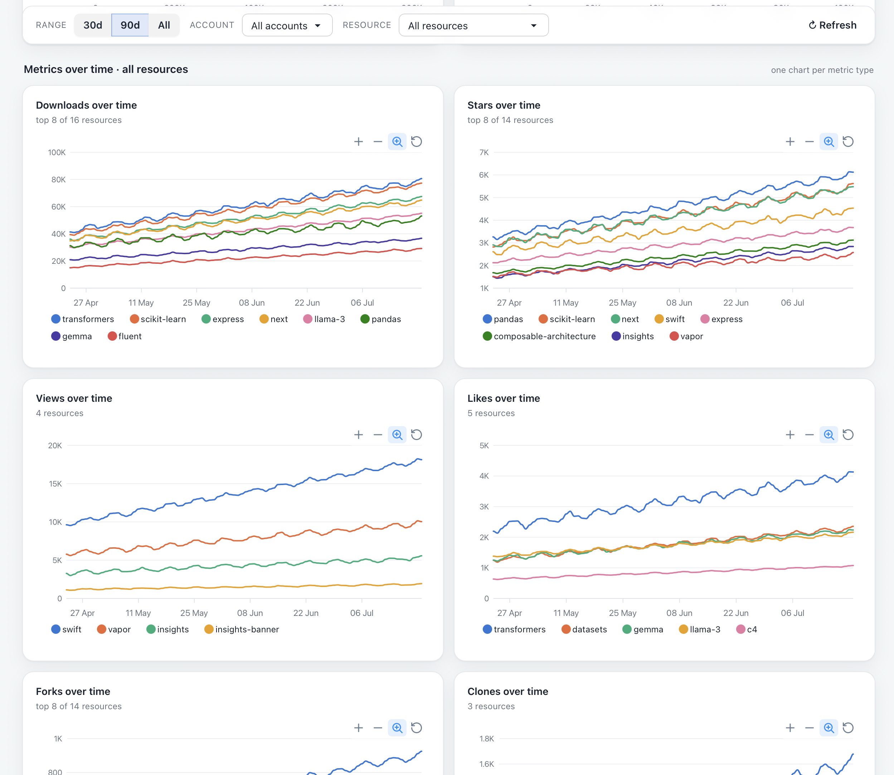

<div align="center">
  <picture>
    <source media="(prefers-color-scheme: dark)" srcset="assets/logo-dark.svg">
    <source media="(prefers-color-scheme: light)" srcset="assets/logo-light.svg">
    
  </picture>

  <p><strong>A Swift Vapor service that tracks the reach of open-source work across GitHub, Hugging Face, npm, and PyPI — and turns it into a live dashboard.</strong></p>

  <p>
    <a href="#overview">Overview</a> •
    <a href="#quick-start">Quick Start</a> •
    <a href="#data-model">Data Model</a> •
    <a href="#api">API</a> •
    <a href="#dashboard">Dashboard</a> •
    <a href="#deployment">Deployment</a> •
    <a href="#development">Development</a>
  </p>

  <p>
    
    
    
    
  </p>
</div>

---

## Overview

**ICICLE Insights** collects popularity metrics for the [ICICLE](https://icicle.osu.edu/) research project and its wider open-source ecosystem, then serves them through a REST API and an interactive dashboard.

It models the world as **accounts** on a platform, the **resources** they publish (datasets, models, packages, images, services), the **releases** of those resources, and a time series of **metrics** — stars, forks, clones, views, downloads, likes, pulls, subscribers.

Highlights:

- ⚡️ **Swift 6.3 + Vapor 4** — fully `async/await`, Sendable-checked, and statically linked for tiny production images.
- 🐘 **Fluent ORM over PostgreSQL** — typed models, migrations, and cascading relationships.
- 📊 **Zero-dependency dashboard** — client-rendered charts with a colour-vision-deficiency-safe palette and light/dark themes.
- 📖 **Code-first OpenAPI** — the spec is reflected from your annotated routes and served through a [Scalar](https://scalar.com/) reference UI at `/docs`.
- 🗓 **Queue-backed jobs** — a Fluent-driven Vapor Queues setup ready for scheduled platform syncs.
- 🚢 **Container-native** — multi-stage Docker build, Compose stack, and a GitHub Actions pipeline that ships to GHCR.

<div align="center">
  <!-- Screenshot #1: GET /dashboard, "All accounts" overview -->
  
</div>

## Prerequisites

| Tool | Version | Notes |
|------|---------|-------|
| [Swift](https://www.swift.org/install/) | 6.3+ | Ships with SwiftPM |
| [PostgreSQL](https://www.postgresql.org/) | 14+ | Local instance or the bundled Compose service |
| [just](https://just.systems/) | any | Task runner for the commands below |
| [SwiftFormat](https://github.com/nicklockwood/SwiftFormat) | any | Only needed for `just fmt` |
| [Docker](https://www.docker.com/) | any | Optional — for the containerised workflow |

## Quick Start

```bash
git clone https://github.com/guzman109/icicle-insights.git
cd icicle-insights
```

**1. Start PostgreSQL.** The fastest path is the bundled Compose database:

```bash
docker compose up db -d
```

This launches Postgres with the default credentials the app expects (`vapor_username` / `vapor_password`).

**2. Configure the environment.** The app reads its database connection from environment variables (a `.env` file is auto-loaded by `just`):

```bash
# .env — all optional; sensible defaults are baked in
DATABASE_HOST=localhost          # default: localhost
DATABASE_PORT=5432               # default: 5432
DATABASE_USERNAME=vapor_username # default: vapor_username
DATABASE_PASSWORD=vapor_password # default: vapor_password
DATABASE_NAME=dev                # default: dev (development) / vapor_database (production)
LOG_LEVEL=info                   # trace | debug | info | notice | warning | error | critical
```

> **Database per environment.** To keep runs from clobbering each other, the app auto-selects a database by Vapor environment: `--env development` → `dev`, `--env testing` → `test`, `--env production` → `DATABASE_NAME` (default `vapor_database`).

**3. Run the migrations, then the server.**

```bash
just migrate   # create the schema (and, in development, seed ~5 months of demo data)
just run       # start the server — http://127.0.0.1:8080
```

Then open:

- **`/dashboard`** — the metrics dashboard
- **`/docs`** — the interactive API reference
- **`/openapi.json`** — the raw OpenAPI spec

## Data Model

Everything hangs off an **Account**. Accounts own **Resources**; resources accumulate **Metrics** (a time series) and **Releases**; each account optionally has a **Vault** for its platform token.



Relationships cascade on delete at the database level, so removing an account cleanly removes its vault, resources, metrics, and releases. Metrics carry a composite index on `(resource_id, type, recorded_at DESC)` to keep the dashboard's time-series queries fast.

## API

All endpoints return JSON with ISO-8601 timestamps. Every route below is documented live at **`/docs`**.

### Accounts

| Method | Path | Description |
|--------|------|-------------|
| `GET`    | `/accounts` | List all accounts |
| `POST`   | `/accounts` | Create an account |
| `GET`    | `/accounts/:accountID` | Get an account (with its resources and vault) |
| `PATCH`  | `/accounts/:accountID` | Update follower count |
| `DELETE` | `/accounts/:accountID` | Delete an account |

### Resources

| Method | Path | Description |
|--------|------|-------------|
| `GET`    | `/resources` | List all resources |
| `POST`   | `/resources` | Create a resource under an account |
| `GET`    | `/resources/:resourceID` | Get a resource by ID |
| `DELETE` | `/resources/:resourceID` | Delete a resource |

### Metrics

| Method | Path | Description |
|--------|------|-------------|
| `GET`    | `/metrics` | List metrics — filter by `?resourceID=`, `?type=`, `?limit=` |
| `POST`   | `/metrics` | Record a metric reading for a resource |
| `GET`    | `/metrics/:metricID` | Get a metric by ID |
| `DELETE` | `/metrics/:metricID` | Delete a metric |

### Releases

| Method | Path | Description |
|--------|------|-------------|
| `GET`    | `/releases` | List all releases |
| `POST`   | `/releases` | Create a release for a resource |
| `GET`    | `/releases/:releaseID` | Get a release by ID |
| `DELETE` | `/releases/:releaseID` | Delete a release |

### Vaults

| Method | Path | Description |
|--------|------|-------------|
| `GET`    | `/vaults` | List all vaults |
| `POST`   | `/vaults` | Create a vault for an account |
| `GET`    | `/vaults/:vaultID` | Get a vault by ID |
| `PATCH`  | `/vaults/:vaultID` | Update the token expiry |
| `DELETE` | `/vaults/:vaultID` | Delete a vault |

### Meta

| Method | Path | Description |
|--------|------|-------------|
| `GET` | `/dashboard` | The interactive metrics dashboard |
| `GET` | `/docs` | Scalar API reference UI |
| `GET` | `/openapi.json` | Generated OpenAPI 3 document |

<details>
<summary>Example: create an account, resource, and metric</summary>

```bash
# 1. Create an account
curl -X POST http://127.0.0.1:8080/accounts \
  -H 'Content-Type: application/json' \
  -d '{"name": "octocat", "platform": "github"}'

# 2. Create a resource under it (use the account id from step 1)
curl -X POST http://127.0.0.1:8080/resources \
  -H 'Content-Type: application/json' \
  -d '{"name": "insights", "type": "service", "accountID": "<ACCOUNT_ID>"}'

# 3. Record a metric reading (use the resource id from step 2)
curl -X POST http://127.0.0.1:8080/metrics \
  -H 'Content-Type: application/json' \
  -d '{"resourceID": "<RESOURCE_ID>", "type": "stars", "reading": 450}'
```

</details>

## Dashboard

`GET /dashboard` serves a single Leaf shell; everything else renders client-side from the JSON API. A single filter bar — **range · account · resource** — scopes three progressively deeper views:

**All accounts → Account → Resource**

Chart form follows the data: totals, distributions, and time series each pick the shape that reads best. Series colours are drawn from a validated CVD-safe categorical palette and adapt to light/dark theme automatically. There is **no build step and no chart library dependency** — just `Public/dashboard.js` and `Public/dashboard.css`.

In development, `just migrate` seeds ~5 months of realistic daily data across every platform, resource type, and metric type, so the dashboard has something rich to show immediately.

<div align="center">
  
</div>

## Deployment

The GitHub Actions pipeline (`.github/workflows/build.yaml`) builds a statically linked Alpine-free Ubuntu image with Docker Buildx and pushes it to GHCR. Tagging a release additionally extracts the binary and attaches a Linux tarball to a GitHub Release.

```bash
# Pull and run the published image
docker pull ghcr.io/icicle-ai/insights:latest
docker run -p 8080:8080 --env-file .env ghcr.io/icicle-ai/insights:latest
```

Cut a release by pushing a version tag:

```bash
git tag v1.0.0 && git push origin v1.0.0
```

### Local Compose stack

The bundled `docker-compose.yml` wires the app to a Postgres instance and provides one-shot migrate/revert services:

```bash
docker compose build              # build the app image
docker compose up db -d           # start PostgreSQL
docker compose run migrate        # apply migrations
docker compose up app             # start the server on :8080
docker compose down               # stop everything (add -v to wipe the database)
```

## Development

### Common commands

```bash
just run        # swift run — start the server
just migrate    # apply database migrations
just revert     # roll back the last migration batch
just test       # run the test suite (serial — see below)
just fmt        # format Sources, Tests, and Package.swift with SwiftFormat
just fmt-check  # lint formatting without writing changes
```

You can also drive Vapor's CLI directly, e.g. `swift run Insights serve --env production --port 8080`.

### Testing

Tests use Swift Testing with Vapor's `VaporTesting` helpers. Each suite boots a `.testing` application against the dedicated `test` database, migrates, runs, and reverts. Because every suite shares that database, the runner is serial:

```bash
just test        # → swift test --no-parallel
```

### Project structure

```
.
├── Sources/Insights/
│   ├── Models/         # Fluent models: Account, Resource, Metric, Release, Vault
│   ├── DTOs/           # Create/Update/Public request & response shapes (+ OpenAPI examples)
│   ├── Controllers/    # RouteCollections for each resource + the dashboard
│   ├── Migrations/     # Schema (FirstMigration) and development seed data (SeedData)
│   ├── Jobs/           # Vapor Queues jobs (GitHub sync)
│   ├── configure.swift # App bootstrap: DB, migrations, Leaf, queues, JSON coding
│   ├── routes.swift    # Route registration
│   ├── OpenAPI.swift   # OpenAPI document + Scalar reference UI
│   └── Validation.swift
├── Resources/Views/    # Leaf templates (index, dashboard)
├── Public/             # dashboard.css, dashboard.js (served statically)
├── Tests/InsightsTests/
├── .github/workflows/  # build.yaml — Docker build → GHCR → release
├── Dockerfile          # Multi-stage Swift build → slim Ubuntu runtime
├── docker-compose.yml  # app + db + migrate/revert services
├── Package.swift       # SwiftPM manifest
└── justfile            # Task runner
```

## Tech Stack

| Package | Purpose |
|---------|---------|
| [Vapor](https://vapor.codes/) | HTTP server, routing, middleware |
| [Fluent](https://docs.vapor.codes/fluent/overview/) + [fluent-postgres-driver](https://github.com/vapor/fluent-postgres-driver) | ORM and PostgreSQL driver |
| [Queues](https://docs.vapor.codes/advanced/queues/) + [vapor-queues-fluent-driver](https://github.com/vapor-community/vapor-queues-fluent-driver) | Background/scheduled jobs, persisted in Postgres |
| [Leaf](https://docs.vapor.codes/leaf/overview/) | Server-side templating for the dashboard shell |
| [VaporToOpenAPI](https://github.com/dankinsoid/VaporToOpenAPI) | Code-first OpenAPI generation |
| [SwiftNIO](https://github.com/apple/swift-nio) | Event-driven networking foundation |

## License

GNU General Public License v3.0 — see [LICENSE](LICENSE).

## Acknowledgments

Part of the [ICICLE (Intelligent Cyberinfrastructure with Computational Learning in the Environment)](https://icicle.osu.edu/) initiative.
