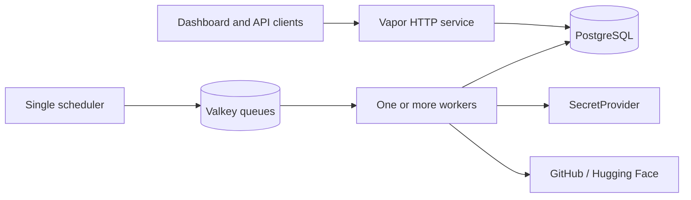

<div align="center">
  <picture>
    <source media="(prefers-color-scheme: dark)" srcset="assets/logo-dark.svg">
    <source media="(prefers-color-scheme: light)" srcset="assets/logo-light.svg">
    
  </picture>

  <p><strong>Open-source impact, measured across platforms.</strong></p>

  <p>
    
    
    
    
    
  </p>

  <p>
    <a href="docs/tutorials/administering-insights.md">Administer</a> ·
    <a href="docs/tutorials/local-development.md">Develop</a> ·
    <a href="docs/how-to/deploy-insights.md">Deploy</a> ·
    <a href="docs/">Documentation</a>
  </p>
</div>

---

Insights collects popularity and usage metrics for open-source accounts and the things they
publish — repositories, models, datasets, packages, containers, and services — and turns them into
a historical REST API and a public dashboard.

Built for the [ICICLE](https://icicle.osu.edu/) research ecosystem. The data model is
platform-neutral, so it suits any community that wants a clearer picture of its open-source reach.

<div align="center">
  
</div>

## What it does

- **One model across platforms.** Accounts, repositories, models, datasets, packages, and
  containers share a consistent metric shape.
- **Totals you can trust.** Overlapping API windows are folded through daily watermarks, so nothing
  is counted twice — even when a job is retried.
- **Durable collection.** Valkey holds queued work while stateless workers scale independently of
  the HTTP service and the scheduler.
- **Public by default, guarded where it matters.** Reads need no credential; every write does.
- **Credentials behind an interface.** Jobs resolve platform tokens through a small provider
  contract rather than being coupled to one backend.

## How it fits together



| Component | Purpose | Scaling |
|---|---|---|
| HTTP service | Dashboard, REST API, OpenAPI | Scale freely |
| Queue worker | Claims and runs collection jobs | Scale freely |
| Scheduler | Evaluates the clocks and dispatches | **Exactly one replica** |
| PostgreSQL | Catalog, readings, due dates, watermarks | One managed database |
| Valkey | Queue storage and rate-limit counters | One shared service |

Two schedulers dispatch every due resource twice. That is the one hard scaling constraint.

## What is collected

| Platform | Metrics | Status |
|---|---|---|
| GitHub repositories | Stars, forks, subscribers, clones, views | Active |
| GitHub accounts | Followers | Active |
| Hugging Face | Likes, rolling downloads, lifetime downloads | Active |
| GHCR, npm, PyPI | — | Registered, not yet collected |

The scheduler scans hourly but each resource has its own cadence, seven days by default. See
[Collection schedule](docs/reference/collection-schedule.md).

## Quick start

```bash
cp .env.example .env
```

Set the Tapis values and `DATABASE_TLS=disable`, then:

```bash
just db
```

```bash
just migrate
```

```bash
just run
```

The full walkthrough, including the dashboard and the container stack, is in
[Local development](docs/tutorials/local-development.md).

Requires Swift 6.3+, Node 24+, [`just`](https://just.systems/), and — for the container stack —
macOS 26 or later with Apple Container.

## The admin console

Administrators get an operations console at `/admin`: collection health, the catalog, vault
credential metadata, service tokens, and access control.

<div align="center">
  
</div>

Start with [Administering Insights](docs/tutorials/administering-insights.md).

## Documentation

Organised on [Diátaxis](https://diataxis.fr/), split by audience. The map is in
**[docs/](docs/)**.

| | Administrator | Developer |
|---|---|---|
| **Tutorial** | [Administering Insights](docs/tutorials/administering-insights.md) | [Local development](docs/tutorials/local-development.md) |
| **How-to** | [Deploy](docs/how-to/deploy-insights.md) · [Issue a token](docs/how-to/issue-a-service-token.md) · [Diagnose a failure](docs/how-to/diagnose-a-collection-failure.md) | [Add a collector](docs/how-to/add-a-collector.md) · [Dashboard toolchain](docs/how-to/set-up-the-dashboard-toolchain.md) · [Run the tests](docs/how-to/run-the-tests.md) |
| **Reference** | [Admin console](docs/reference/admin-console.md) · [Configuration](docs/reference/configuration.md) · [CLI](docs/reference/cli.md) | [HTTP API](docs/reference/http-api.md) · [Data model](docs/reference/data-model.md) · [Invariants](docs/reference/invariants.md) |
| **Explanation** | [Watermarks](docs/explanation/watermarks.md) · [Authentication](docs/explanation/authentication.md) | [Architecture](docs/explanation/architecture.md) · [Decisions](docs/explanation/decisions/) |

## Development

```bash
just
```

Lists every recipe, grouped: `swift`, `web`, `cli`, `setup`, `containers`, `collect`, `stack`.
See [just recipes](docs/reference/just-recipes.md).

```bash
just test
```

195 tests across 15 suites, run serially against a dedicated `test` database.

## Deploying

Set the five required variables, run migrations, create the signing keyset, and check the boot log.
The full sequence is in [Deploy Insights](docs/how-to/deploy-insights.md).

## License

GNU General Public License v3.0. See [LICENSE](LICENSE).

## Acknowledgments

Developed as part of
[ICICLE (Intelligent Cyberinfrastructure with Computational Learning in the Environment)](https://icicle.osu.edu/),
an NSF-funded AI institute (OAC 2112606).
