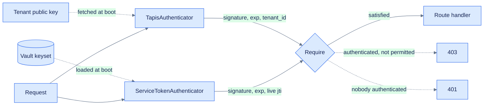

# API authentication

How callers prove who they are and what that entitles them to. Rationale lives in
[ADR 006](decisions/006-api-authentication.md) and [ADR 007](decisions/007-hardening.md); this
page describes what exists and how to operate it.

**Reads are public.** Insights is a public dashboard, so `GET` on accounts, resources, releases,
and metrics needs no credential. Everything that writes is guarded, plus vault and service-token
reads, which are admin-only because enumerating which credentials exist is reconnaissance.

Two kinds of caller present credentials:

| Caller | Credential | May do |
|---|---|---|
| A person on the dashboard | Tapis JWT | Everything, if they are an admin |
| A deployed ICICLE service | Webhook token this server minted | Post metrics for exactly one resource |



Both authenticators run on every `/api` request and **neither rejects anything**. Each logs in its
identity if the bearer value is one it recognises and returns quietly otherwise. That is what keeps
reads open to anonymous callers; `Require`, attached per route inside each controller, decides who
may proceed.

## People: Tapis tokens

`TapisAuthenticator` verifies the bearer against the tenant's RSA public key, fetched once at boot
from `GET {TAPIS_BASE_URL}/tenants/{TAPIS_TENANT}`. Verification is local, so there is no round
trip to Tapis on the request path and the caller's token is never forwarded anywhere.

Identity comes from the token's claims — `tapis/tenant_id`, `tapis/username`, `tapis/account_type`
— rather than from `/v3/oauth2/userinfo`, which does not return the tenant.

**The tenant claim is compared against `TAPIS_TENANT` after verification, and that check is not
optional.** A valid signature does not establish which tenant issued the token. Mismatches are
logged at `notice`, because the likeliest cause is a misconfigured `TAPIS_TENANT` refusing every
admin right now.

Fetching the key rather than pinning it means a Tapis key rotation costs a restart instead of every
request failing 401 with nothing in the log to explain it.

## Who is an admin

Two sources:

- **`ROOT_ADMIN_USERNAME`** — one username, always an admin, whatever the table says. It cannot be
  removed through the API. Break-glass: admins are managed from the dashboard, so deleting the last
  row would otherwise lock everyone out of the surface needed to fix it.
- **The `admins` table** — everyone else, granted and revoked through `AdminController`. Adding a
  person no longer requires a redeploy.

Both resolve through `Request.isAdmin(_:)`, and the result rides on `TapisUser.isAdmin`.

Resolution happens during *authentication*, not inside `Require`, whose predicate is synchronous
and cannot reach the database. One indexed lookup per authenticated request, and revocation takes
effect on the next request rather than at the next restart.

`ROOT_ADMIN_USERNAME` must be a real `tapis/username` in the configured tenant. A placeholder boots
perfectly well and then matches nobody, so every write returns 403 with nothing explaining it.

## Services: webhook tokens

Each deployed ICICLE service reports its own metrics with a token scoped to one resource. The
service holds nothing else — no Tapis identity, no vault access:

```
INSIGHTS_METRICS_URL=https://insights.example.org/api/resources/<uuid>/metrics
INSIGHTS_TOKEN=eyJhbGciOiJIUzI1NiIs…
```

Claims: `iss`, `jti`, `iat`, `exp`, `insights/resource_id`. The resource binding and the expiry are
inside the signature, so neither can be widened by the holder. Signed HS256 — the same process
mints and verifies, so an asymmetric key would buy nothing.

The signing keys live in **their own `JWTKeyCollection`**, never `app.jwt.keys`. Sharing one
collection across two trust domains is a correctness bug waiting to happen: JWTKit falls back to
the default signer when a `kid` is unknown, and Tapis tokens carry a `kid` this server never
registers — a legitimate admin would be verified against the HMAC key and rejected.

### Why there is still a database row

A JWT gives expiry and the resource binding for free. It cannot give revocation. So `service_tokens`
holds `jti`, resource, label, expiry, and `revokedAt`, and every request resolves the `jti` against
a live row. **The row holds no credential** — only a random identifier and metadata.

Order matters: signature and expiry first, which rejects Tapis tokens and noise without touching
Postgres; the lookup runs only for a token this server actually minted. The lookup is deliberately
not cached, because caching it would delay revocation, which is the only reason the row exists.

### Operating them

`ServiceTokenIssuer` is the single home for mint, revoke, and list. `ServiceTokenController`
(admin-only) and `ServiceTokenCommand` are both thin wrappers, so a token minted from a terminal
behaves identically to one minted from the browser.

```bash
swift run Insights service-token init-key                                  # once, before anything
swift run Insights service-token issue --resource <uuid> --label prod-abc
swift run Insights service-token list
swift run Insights service-token revoke --jti <uuid>
swift run Insights service-token rotate-key
```

The token is returned exactly once, by the call that mints it. Nothing persists it and no route
reads it back; a lost token is revoked and reissued.

**Minting for a resource that already has a live token revokes the old one**, in the same
transaction. One working credential per resource, always.

### Rotation

The vault secret is a keyset, not a bare string:

```json
{ "active": "k2", "keys": [ {"kid": "k2", "secret": "…"}, {"kid": "k1", "secret": "…"} ] }
```

Every key registers under its `kid`; new tokens are signed with `active`. `rotate-key` *adds* to
the live collection — safe at runtime, since the collection is an actor — so tokens issued before a
rotation keep verifying until they expire. Rotation is not a flag day and needs no restart. Keys
older than the longest possible token lifetime are dropped rather than accumulating.

## First-time setup

`service-token init-key` must run once per deployment, and **staging and production are separate
vaults** — a keyset created against one does not carry over.

Until it exists, the application boots with an empty keyset: webhook authentication recognises
nobody, while admin access, public reads, and collection are unaffected. `configure` logs this at
`critical` naming the command to run, and minting returns a message pointing at it.

This is deliberately survivable rather than fatal. Every command routes through `configure`, so a
hard failure would take down `service-token init-key` itself — the only thing that creates the
keyset — and a fresh deployment could never be bootstrapped.

A read that is *refused* rather than absent still aborts the boot. A 401 means `TAPIS_TOKEN` is
wrong, which breaks every collection job, and must not be mistaken for a deployment that has simply
not been set up yet.

## Requirement per route

| Controller | Routes | Requirement |
|---|---|---|
| Account, Resource, Release, Metric | `index`, `show` | public |
| Account, Resource, Release, Metric | `create`, `update`, `delete` | `.admin` |
| Metric | `POST /resources/:resourceID/metrics` | `.resourceScoped` |
| Vault | all five, reads included | `.admin` |
| ServiceToken | all | `.admin` |
| Admin | all | `.admin` |

Requirements attach *inside* each controller's `boot`, so the guard is read together with the route
it guards. Guarded routes are marked `.openAPI(auth: .bearer())`; the generated document carries
the bearer scheme on all 22 of them.

`.resourceScoped` is the only requirement a non-human can satisfy, and it covers exactly one route.
Admins are checked first within it, so a person is never locked out of a route a service can reach.
Deletes are admin-only throughout: a malfunctioning service should at worst write bad rows, never
remove history.

## Configuration

| Variable | Notes |
|---|---|
| `TAPIS_BASE_URL` | Needs the `/v3` suffix. Must name the same tenant as below — each tenant has its own host. |
| `TAPIS_TENANT` | Compared against every caller's `tapis/tenant_id`. |
| `TAPIS_USER`, `TAPIS_TOKEN` | The service identity used for vault reads. |
| `ROOT_ADMIN_USERNAME` | Break-glass admin. Boot fails when empty. |
| `TOKEN_SIGNING_SECRET` | Vault secret holding the keyset. Defaults to `insights-token-signing-key`. |
| `CORS_ORIGINS` | Comma-separated. Unset installs no CORS middleware at all. |
| `FRAME_ANCESTORS` | Comma-separated origins permitted to iframe the dashboard. Unset denies framing. |
| `RATE_LIMIT_PER_MINUTE` | Per client IP across `/api`. Default 300. |
| `WEBHOOK_RATE_LIMIT_PER_MINUTE` | Per token on the webhook route. Default 60. |

`TAPIS_BASE_URL` and `TAPIS_TENANT` move together:

```
production   icicleai   https://icicleai.tapis.io/v3
staging      icicleai   https://icicleai.staging.tapis.io/v3
```

Mixing host and tenant is quiet and expensive — the tenant record still resolves, so boot succeeds,
and then every admin is refused with a bare 403. The boot log prints both together so a mismatch is
visible on startup.

## Browser clients

**Send the token as `Authorization: Bearer`.** Reading it from a cookie was considered and
deliberately not built, for two reasons:

1. **Cookies are scoped by domain, not by frame.** Served from a different registrable domain than
   the embedding page, the browser never sends that page's cookie here — the feature would silently
   do nothing.
2. **Cookie credentials are CSRF-exposed by construction**, since the browser attaches them
   automatically. Every mutating route would need a companion defence. Bearer headers are immune
   because a browser never adds them on its own.

A frontend embedded in another application should obtain the token from its parent — a
`postMessage` handshake with a strict origin check is the standard cross-domain answer — hold it in
memory, and attach it as a header.

Embedding additionally requires `FRAME_ANCESTORS` to name the embedding origin. Unset, the response
carries `X-Frame-Options: DENY` and CSP `frame-ancestors 'none'`, and the browser blocks the frame.

## A note on the tenant PEM

Tapis returns `public_key` as a single unwrapped base64 line. RFC 7468 requires 64-character lines
and SwiftASN1 enforces it, so the key as published cannot be parsed —
`Insecure.RSA.PublicKey(pem:)` throws `invalidPEMDocument`. `TapisClient.normalizePEM` re-wraps it.

Worth knowing because no test caught it: `.testing` skips the fetch entirely, so it appeared only on
a real boot, where it crashed the process. There is now a regression test feeding an unwrapped PEM
through the same path.

## Testing

See the [test reference](testing.md). `AuthenticationTests` (22) covers both credential paths and
the crossover cases; `HardeningTests` (35) covers headers, limits, rotation, admins, and the
absent-keyset behaviour; `ServiceTokenControllerTests` (9) covers HTTP minting.

#icicle-insights# #authentication# #middleware# #tapis# #security# #developer-documentation#
