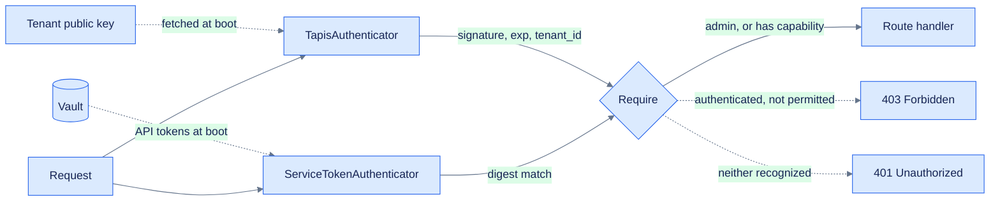

# API authentication

> **Status: built.** Lives in `Sources/Insights/Middlewares/` and
> `Sources/Insights/Services/ServiceTokens/`. Decision record in
> [`decisions/006-api-authentication.md`](decisions/006-api-authentication.md); remaining work in
> [`../TODO.md`](../TODO.md). Where the built design departs from an earlier draft of this
> document, the departure and its reasoning are called out in place rather than edited away.

Reads are open — the dashboard is a public site. Everything that writes is guarded, and there are
two kinds of caller presenting credentials, authenticating differently:

- **Humans on the dashboard** present a Tapis token. A few named accounts hold admin rights and
  can do everything, including mutating vaults and minting webhook tokens.
- **Deployed services** present a webhook token this server minted. Each may post metrics for
  exactly one resource. Nothing else.

That gives three middlewares: one authenticator per credential type, plus a shared requirement
check that decides whether whoever was authenticated may proceed.



## 1. Authenticator — proves who

An `AsyncBearerAuthenticator` combining two steps: read the identity out of the token's
claims, then prove the token is genuine by forwarding it to Tapis.

**Identity comes from the JWT claims, not from the userinfo response.** A Tapis token carries
`tapis/tenant_id`, `tapis/username`, and `tapis/account_type` in its payload; userinfo does
not return the tenant. So the middleware decodes the payload segment itself.

Signatures are verified locally against the tenant's RSA public key, so there is no round trip
to Tapis on the request path. This adds a `vapor/jwt` dependency (5.x, JWTKit 5) — not
currently in `Package.swift`.

- Fetch the key from `GET {baseURL}/v3/tenants/{tenant_id}`, whose `public_key` field is a PEM
  — feed it straight to `Insecure.RSA.PublicKey(pem:)`. RSA lives under `Insecure` in JWTKit 5;
  the name reflects the algorithm's status, not a misuse.
- Register it once at boot into `app.jwt.keys`, not per request.
- **Compare `tapis/tenant_id` against the configured `TAPIS_TENANT` after verifying.** See
  "Verification does not establish the tenant" below — this check is not optional.
- Fill the `authBaseURL` TODO at `TapisConfig.swift:34-37`; `TapisClient+Auth.swift` is the
  intended home for the key fetch and is currently empty.

```swift
struct TapisToken: JWTPayload {
  let tenant: String
  let username: String
  let accountType: String
  let expiration: ExpirationClaim

  enum CodingKeys: String, CodingKey {
    case tenant = "tapis/tenant_id"
    case username = "tapis/username"
    case accountType = "tapis/account_type"
    case expiration = "exp"
  }

  func verify(using algorithm: some JWTAlgorithm) async throws {
    try expiration.verifyNotExpired()
  }
}

struct TapisUser: Authenticatable, Sendable {
  let username: String
  let tenant: String
}

struct TapisAuthenticator: AsyncBearerAuthenticator {
  func authenticate(bearer: BearerAuthorization, for request: Request) async throws {
    let token = try await request.jwt.verify(bearer.token, as: TapisToken.self)
    // A valid signature does not imply the right tenant.
    guard token.tenant == request.application.tapisConfig.tenant else { return }

    request.auth.login(TapisUser(username: token.username, tenant: token.tenant))
  }
}
```

Returning without calling `login` leaves the request unauthenticated; `guardMiddleware()`
turns that into the 401. A verification failure throws, which Vapor also surfaces as 401.

Confirm `add(rsa:digestAlgorithm:)` and `req.jwt.verify(_:as:)` against the resolved package
before relying on the snippet — JWTKit's key-collection API changed between 4 and 5, and
`JWTKeyCollection` is an actor in 5, so registration is `await`ed.

### Why check the tenant claim at all

Whether a valid signature already implies the right tenant depends on how the site provisions
signing keys. `/v3/tenants/{tenant_id}` exposes a `public_key` per tenant, which suggests
per-tenant keys — in which case a foreign tenant's token fails verification outright and the
claim check is redundant. If tenants at a site share a signing key instead, the claim is the
only thing telling them apart. Settle it once:

```sh
curl -s https://<tenant>.tapis.io/v3/tenants | jq '.result[] | {tenant_id, public_key}'
```

Keep the comparison either way — one line, correct under both outcomes.

This applies to *local* verification only. The userinfo fallback below gets the check for
free, since `TAPIS_BASE_URL` is tenant-scoped and Tapis rejects a foreign token itself.

### Key rotation

Pinning a hardcoded PEM in source means that when Tapis rotates, every request begins failing
401 with nothing in the logs explaining why. Fetching at boot costs one call and turns
rotation into a restart instead of a deploy. Confirm `alg` by decoding a real token's header
rather than assuming RS256.

### Fallback

If local verification proves impractical, the alternative is `GET {baseURL}/v3/oauth2/userinfo`
with the caller's token in `X-Tapis-Token` — 200 valid, 401 not — combined with an unverified
base64url decode of the payload for the tenant and username claims. That is sound *only*
because tampering with a claim breaks the signature and so fails the userinfo call; it stops
being sound the moment that call is cached or skipped. Local verification avoids the whole
argument.

This path is for humans on the dashboard only. Machine clients never present a Tapis token —
they use the API tokens in section 3.

## 2. Who is an admin

Two sources, deliberately:

- **`ROOT_ADMIN_USERNAME`** — one username, always an admin, whatever the table says. It cannot
  be removed through the API. This is the break-glass path: managing admins from the dashboard
  means an accidental deletion of the last row would otherwise lock everyone out of the surface
  needed to fix it.
- **The `admins` table** — everyone else, granted and revoked from the dashboard through
  `AdminController`. Adding a person stopped requiring a redeploy.

Both are resolved by `Request.isAdmin(_:)` and the result is carried on `TapisUser.isAdmin`.

**Where that resolution happens matters.** `Require` holds a synchronous predicate
(`@Sendable (Request) -> Bool`), so it cannot query. Admin status is therefore looked up once
during authentication — `TapisAuthenticator` is already async — and `Require.admin` reads a flag.
One indexed lookup per authenticated request, the same cost already accepted for the webhook
token lookup, and revocation takes effect on the next request rather than at the next restart.

> **Reversed during implementation.** This section previously specified an `ADMIN_USERNAMES`
> environment allowlist and argued against a table: *"Three people, changing maybe twice a year."*
> True, but it made every personnel change a redeploy, which is the wrong trade once there is a
> dashboard to manage them from. The break-glass username preserves what the env var was actually
> good for — no bootstrap problem, no way to lock yourself out.

Deliberately **not** derived from Tapis's own `admin_user` field or Security Kernel roles. Those
say who administers the Tapis *tenant*; coupling them would let a TACC-level role change grant or
revoke Insights access for unrelated reasons.

## 3. Webhook tokens

Every service ICICLE deploys reports its own metrics over a webhook. Each is issued a **JWT this
server mints**, scoped to exactly one resource, expiring, and revocable on demand.

The deployed service holds one thing: its token. No Tapis identity, no Vault access, no cluster
credentials. It reads two values from its deployment secret and posts:

```
INSIGHTS_METRICS_URL=https://insights.icicleai.org/api/resources/<uuid>/metrics
INSIGHTS_TOKEN=eyJhbGciOiJIUzI1NiIs…
```

### What the token carries, and what it cannot

```
iss: "icicle-insights"   jti   iat   exp   insights/resource_id
```

The resource binding is inside the signature, so a service cannot edit it to write into another
service's series. Expiry is there for the same reason. Signed **HS256** with one 32-byte secret
in Vault behind `SecretProvider` — the same process mints and verifies, so an asymmetric key
would buy nothing.

> Register the signing key in its **own `JWTKeyCollection`**, never `app.jwt.keys`. Sharing one
> collection across two trust domains is a correctness bug waiting to happen: JWTKit falls back
> to whichever signer is default when a token's `kid` is unknown, and Tapis tokens carry a `kid`
> this server never registers. A legitimate admin would be verified against the HMAC key and
> rejected.

### Why there is still a database row

A JWT gives expiry and the resource binding for free. It cannot give revocation — a token already
handed out has no way to learn it was cancelled. So `service_tokens` holds `jti`, resource, label,
expiry, and `revokedAt`, and every authenticated request resolves the `jti` against a live row.
**The row holds no credential**, only a random identifier and metadata, so nothing secret enters
the database this API already serves.

Verification order matters: signature and `exp` first, which rejects Tapis tokens, anonymous
traffic, and noise without touching Postgres; the lookup runs only for a token this server minted.

Revoking is one `UPDATE`. The service's next request is refused — no restart, because the lookup
is live rather than cached at boot.

### Issuing

`ServiceTokenIssuer` is the single home for mint, revoke, and list. Both `ServiceTokenController`
(admin-only, for the dashboard) and `ServiceTokenCommand` are thin wrappers over it, so a token
minted from a terminal behaves identically to one minted from the browser.

```
swift run Insights service-token init-key
swift run Insights service-token issue --resource <uuid> --label prod-inference
swift run Insights service-token list
swift run Insights service-token revoke --jti <uuid>
```

The token is returned exactly once, by the call that mints it. Nothing persists the value and no
route reads it back; a lost token is revoked and reissued.

**Minting for a resource that already has a live token revokes the old one**, in the same
transaction. One working credential per resource, always — a replaced token cannot be left behind
still functioning.

> **Reversed during implementation.** This section previously argued minting must stay off HTTP
> entirely: *"an HTTP route that mints credentials is permanently exposed and has to be defended
> at least as well as everything it can grant."* That still holds for broad credentials. It does
> not hold for these: one resource, one route, expiring, revocable. An attacker who reaches the
> mint endpoint already holds admin, and could write those metrics directly. The CLI remains,
> because `init-key` has to run before anything can be issued at all.

> **Also reversed.** An earlier design had the *deployed service* fetch its token from Tapis
> Vault. That requires shipping a broader credential in order to bootstrap a narrower one, and a
> shared Tapis identity across services would let each read the others' tokens, erasing the
> scoping. Minted tokens go into the deployment's own secret store instead. Vault keeps its
> existing job: the **server** reading platform credentials for collection jobs.

## 4. Composition

Both authenticators run on the whole `/api` group; each logs in its own `Authenticatable` if
the bearer value is one it recognizes, and returns quietly otherwise. Neither ever rejects,
which is what keeps the reads open to anonymous callers.

```swift
let api = app.grouped("api").grouped(TapisAuthenticator(), ServiceTokenAuthenticator())
```

Requirements attach *inside* each controller's `boot`, because the controllers own their routes
and the requirement differs per route within one controller. Keeping them adjacent means the
guard is read together with the route it guards:

```swift
resources.get(use: index)                            // public
resources.grouped(Require.admin).post(use: create)   // humans only

// The webhook route: an admin, or the one service bound to this resource.
routes.grouped("resources", ":resourceID", "metrics")
  .grouped(Require.resourceScoped)
  .post(use: createForResource)
```

`guardMiddleware()` doesn't fit here: on shared routes neither identity is individually
required, so the requirement has to be expressed as one middleware that accepts either.

```swift
struct Require: AsyncMiddleware {
  let satisfiedBy: @Sendable (Request) -> Bool

  static let admin = Require { req in
    req.auth.get(TapisUser.self).map {
      req.application.adminUsernames.contains($0.username)
    } ?? false
  }

  static let resourceScoped = Require { req in
    if Require.admin.satisfiedBy(req) { return true }
    guard
      let client = req.auth.get(ServiceClient.self),
      let path = req.parameters.get("resourceID", as: UUID.self)
    else { return false }
    return client.resourceID == path
  }

  func respond(to request: Request, chainingTo next: AsyncResponder) async throws -> Response {
    guard satisfiedBy(request) else {
      let authenticated = request.auth.has(TapisUser.self) || request.auth.has(ServiceClient.self)
      throw Abort(authenticated ? .forbidden : .unauthorized)
    }
    return try await next.respond(to: request)
  }
}
```

Admins are checked first — otherwise a human would be locked out of the one route services can
reach. Distinguishing 401 from 403 at the end preserves the signal: a bearer nobody could
authenticate is 401, an authenticated caller lacking permission is 403. A valid webhook token
aimed at someone else's resource is the 403 case: real credential, wrong target.

Order matters: authenticators populate `req.auth`, then `Require` reads it.

Protected routes are marked `.openAPI(auth: .bearer())`; `VaporToOpenAPI` reflects the scheme
into the document from there. `DashboardController`, `/openapi.json`, and `/docs` stay at root
and stay open.

## 5. Hardening

**CORS** — `CORSMiddleware` from a `CORS_ORIGINS` allowlist, registered `at: .beginning`. That
placement is load-bearing: response headers are stamped on the way back out, so anything
registered after `ErrorMiddleware` never sees an error response, and a 4xx without CORS headers
is unreadable to the browser that caused it. Unset means no CORS middleware at all.

**Security headers** — `nosniff`, `Referrer-Policy`, `X-Frame-Options`, and HSTS in production,
same placement and for the same reason. CSP waits on the Angular bundle's origins.

**Rate limits** — `RateLimiter`, a Redis fixed window over the Valkey queues already use, so the
ceiling holds across pods rather than being granted afresh by each replica. Per client IP on
`/api` (300/min), per token on the webhook route (60/min), both env-tunable. Keyed on the token
rather than the address there, because that is what actually runs away and several services may
share an egress IP.

It **fails open**: a Redis error is logged and the request proceeds. A limiter that takes the API
down when its counter store hiccups causes more harm than the abuse it prevents.

**Signing key rotation** — the Vault secret is a keyset, not a bare string:

```json
{ "active": "k2", "keys": [ {"kid": "k2", "secret": "…"}, {"kid": "k1", "secret": "…"} ] }
```

Every key registers under its `kid` into one `JWTKeyCollection`; new tokens are signed with
`active`. `rotate-key` *adds* to the live collection — safe at runtime because the collection is
an actor — so tokens issued before a rotation keep verifying until they expire. Rotation is not a
flag day, and never requires a restart.

## A note on the tenant PEM

Tapis returns `public_key` as a single unwrapped base64 line. RFC 7468 requires 64-character
lines and SwiftASN1 enforces it, so the key as published cannot be parsed —
`Insecure.RSA.PublicKey(pem:)` throws `invalidPEMDocument: incorrect line lengths`.
`TapisClient.normalizePEM` re-wraps it.

Worth knowing because no test caught this: `.testing` skips the fetch entirely, so it only
appeared on a real boot, where it crashed the process. There is now a regression test that feeds
an unwrapped PEM through the same path.

## Requirement per route

| Controller | Routes | Requirement |
|---|---|---|
| all | `index`, `show` | public — except `VaultController` and `ServiceTokenController` |
| `MetricController` | `POST /resources/:resourceID/metrics` | `.resourceScoped` |
| every other mutating route | `create`, `update`, `delete` | `.admin` |
| `VaultController` | all five, reads included | `.admin` |
| `ServiceTokenController` | all three | `.admin` |

Deletes are admin-only throughout. A malfunctioning service should at worst write bad rows, not
remove history; nothing in the webhook story requires deletion.

`.resourceScoped` is the only requirement a non-human can satisfy, and it covers exactly one
route. Everything else is human-only.

> **Changed during implementation.** `VaultController`'s reads are admin-only rather than public
> or service-reachable. `Vault.Public` carries no secret value, but enumerating which credentials
> exist and when they expire is reconnaissance, and no service has a reason to ask.

## Deliberately deferred

- **Validation caching** — moot for Tapis tokens; local verification has no round trip to
  amortize. The webhook `jti` lookup is deliberately *not* cached: caching it would delay
  revocation, which is the only reason the row exists.
- **Tapis key rotation without restart** (JWKS plus `JWKSCache`, honoring `Cache-Control`) — a
  restart is an acceptable response at this scale. Worth revisiting: it would also give real
  `kid` routing, which today falls back to a single default key and quietly stops working the day
  Tapis publishes two.
- **CORS** — same-origin in production, dev-server proxy in development.
- **Webhook token renewal** — tokens expire at 90 days and are replaced by minting a new one and
  updating the deployment secret. An automatic renewal path would need a credential to renew
  with, which is the bootstrapping problem again.
- **Rate limiting the webhook route** — a compromised service can already write bad readings for
  its own resource; volume is the only extra harm, and it is bounded by one resource's series.

## Testing

`Tests/InsightsTests/AuthenticationTests.swift` and `ServiceTokenControllerTests.swift`, with
fixtures in `TestSupport.swift`. Two throwaway RSA keypairs are checked in as `TestKeys` and used
nowhere else, so tokens are signed locally and no test touches a live tenant. `configure` skips
the tenant key fetch and the Vault read for the signing key under `.testing`;
`installTestCredentials` supplies both in memory.

Webhook tokens in tests are minted through `ServiceTokenIssuer`, the same path the CLI and the
controller use, so fixtures cannot drift from production behavior. `signWebhookToken` exists only
for tokens no legitimate path would produce — expired, foreign-issuer, wrong key, orphaned `jti`.

Tapis path: valid admin token, valid non-admin (403), expired (401), token signed by a *different*
keypair (401), a correctly signed token carrying a foreign `tapis/tenant_id` (401 — the case a
signature check alone would let through), a non-JWT bearer value (401).

Webhook path: a token posting to its own resource (201) and to another (403); revoked (401);
expired (401); wrong signing key (401); foreign issuer (401); a valid signature whose `jti` has no
row (401 — what a deleted token looks like).

Crossover cases are the ones most likely to break and least likely to be written:

- an admin on the webhook route for any resource — must succeed, since `Require.resourceScoped`
  checks admin first
- a webhook token on an admin route — 403, not 401
- a webhook token attempting to mint another token — 403, or a leaked token becomes a
  credential-minting oracle
- a Tapis token arriving where a webhook token is expected — must not be mistaken for a malformed
  one and produce a confusing error

Keep the foreign-tenant test even though it looks redundant next to the bad-signature test. They
fail for different reasons, and it is the one that regresses if someone later decides the tenant
comparison is unnecessary. Same for the unknown-`jti` test: it is what proves revocation is
enforced by presence, not by a flag someone could forget to check.

#icicle-insights# #authentication# #middleware# #tapis# #security# #developer-documentation#
