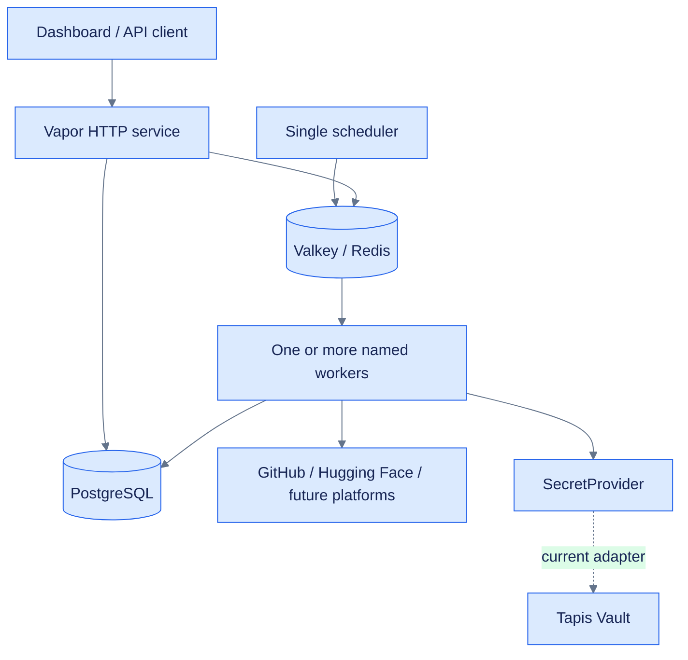
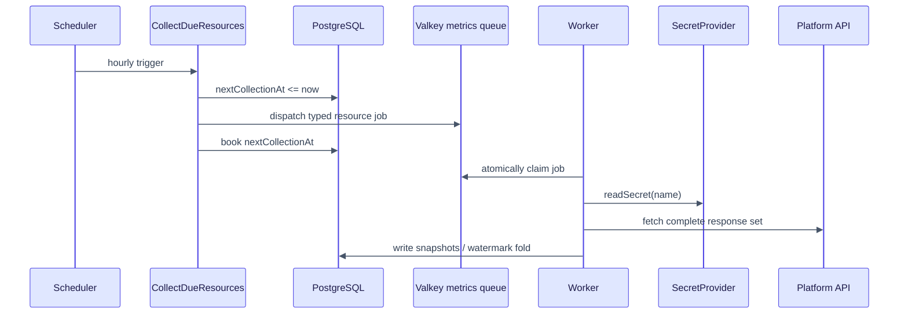

# Architecture

Insights separates HTTP delivery, scheduling, queue execution, persistence, platform APIs, and
credential storage so each can change or scale independently.



## Responsibilities

| Component | Owns | Does not own |
|---|---|---|
| Controllers | HTTP decoding, validation, responses | Provider-specific secret access |
| Scheduler | Deciding when dispatcher jobs run | Slow platform API calls |
| Dispatchers | Finding eligible records and enqueueing typed jobs | Executing the sync |
| Workers | Claiming and executing queued jobs | Clock evaluation |
| PostgreSQL | Catalog, readings, due dates, watermarks | Queue delivery |
| Valkey | Durable queued payloads | Domain records or metric history |
| `SecretProvider` | Named credential lifecycle | Metrics or platform routing |
| Platform jobs | Fetching and translating provider data | Choosing the secret backend |

## Resource collection lifecycle



## Composition root

`configure.swift` is the one place concrete infrastructure is selected. Consumers use
protocols or framework abstractions. For example, jobs call `application.secrets`; configuration
chooses `TapisClient.Vaults` when `SECRET_PROVIDER=tapis`.

## Source layout

```text
Sources/Insights/
├── Commands/       one-shot operator commands
├── Controllers/    HTTP boundaries (dashboard intentionally separate)
├── DTOs/           request and public response shapes
├── Errors/         configuration and job failures
├── Migrations/     PostgreSQL schema and development snapshot
├── Models/         Fluent domain persistence
├── Queues/         dispatchers, workers, routing, watermark folds
├── Services/
│   ├── Secrets/    provider-neutral protocol, redacted value, app storage
│   └── Tapis/      current Tapis Vault adapter
└── configure.swift composition root
```

Read [invariants.md](invariants.md) before changing interactions between these components.

#icicle-insights# #architecture# #swift# #vapor# #developer-documentation#
