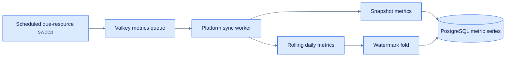

# Metric collection

How Insights turns platform readings into trustworthy snapshots and historical totals.



For a focused, plain-language explanation of the bookmark used by rolling metrics, see
[watermarks.md](watermarks.md).

## Why rolling windows need special handling

GitHub's `/traffic/clones` and `/traffic/views` return a **rolling 14-day total** in their
top-level `count`, rather than a delta since the last sweep. Adding that value directly with
`Metric.addToAllTime` would re-add every day shared with the previous response. At a daily
cadence, a single day could be counted about 14 times.

Hugging Face exposes the same metric shape through its trailing 30-day `downloads` figure. Its
separate lifetime value allows Insights to replace the all-time total directly.

## Two kinds of metric

| Kind | Examples | API reports | All-time handling |
|---|---|---|---|
| Gauge | stars, forks, subscribers, likes | full current value | none — `MetricType.allTime` is nil |
| Rolling window | clones, views (14d), downloads (30d) | overlapping window | watermark fold, or platform's own total |

A gauge needs no all-time row because **the series is the record** — one row per sweep, free to
fall as well as rise. That is what the Trend section on the dashboard plots.

## The watermark

`MetricWatermark` is one row per `(resource, metric type)` holding `countedThrough`: the newest
completed day already folded into the all-time total.

`Metric.foldDailyIntoAllTime` counts a day only if it is:

1. **newer than the watermark** — everything at or before it is already counted, and
2. **older than today's UTC midnight** — today is still accruing. Banking a partial day would
   record a low figure and then skip the rest of it, because the watermark would have moved
   past that day before the next sweep saw it complete.

The watermark is deliberately **not** the same thing as `Resource.nextCollectionAt`:

- `nextCollectionAt` — *when to fetch next*
- `countedThrough` — *what has been counted*

Keeping them separate is what lets a late sweep resume exactly where the last one stopped. Fuse
them and you are back to assuming sweeps land on schedule.

**Days that age out of the retention window before a sweep runs are gone.** Neither endpoint
offers backfill. `Platform.maxCollectionIntervalDays` (14 GitHub, 30 Hugging Face) is what
bounds the interval; `ResourceController.create` enforces it.

Hugging Face gets a snapshot instead of a fold — the Hub reports `downloadsAllTime` itself, so
`Metric.setAllTime` assigns rather than accumulates and re-running a sweep is harmless.

## Scheduling

- `Resource.nextCollectionAt` + `collectionIntervalDays` (default 7)
- `CollectDueResources` — hourly, dispatches everything with `nextCollectionAt <= now`, then
  advances each **from now**, not from the old due date. After downtime a stale date would
  otherwise leave a resource due immediately, once per missed interval.
- `CollectAccountStats` — monthly on the first day at 03:00, org followers. Per-Account, so it is kept out of the resource
  sweep, which would otherwise dispatch it once per resource the account owns.
- Routing is on `Account.platform`, not `Resource.type`: type says what a thing is, not which
  API reports on it. `ghcr` / `npm` / `pypi` are logged and skipped.

## Runtime roles

`app.queues.add(...)` registers a handler. Execution requires both a scheduler to dispatch due
work and a named worker to consume it. The HTTP service runs independently from both roles.

Two processes are now required:

```
just queues      # queues --queue metrics    — runs the syncs
just scheduled   # queues --scheduled        — runs the sweeps
```

Run exactly one scheduler. Two would dispatch every due resource twice.

## Running the stack

The `just` recipes drive Apple `container` and need macOS 26+ for user-defined networks.
`docker-compose.yml` describes the same stack for Compose-based environments.

```
just stack     # network, db, valkey, migrate, app, queues, scheduled
just stop      # stop all five containers
just clean     # stop, then delete the network
```

Containers share the `icicle-insights` network. Docker Compose resolves `db` and `valkey` by
service name. The Apple Container recipes inspect the current PostgreSQL and Valkey addresses
and inject them into each application container because Apple Container 1.0.0 does not reliably
resolve peers by name on the custom network.

Jobs are held in Valkey, not Postgres — the worker's poll is a blocking pop rather than a table
scan on every tick, and there is no jobs table to migrate. Any Redis-protocol server works; the
driver is [queues-redis-driver](https://github.com/vapor/queues-redis-driver). Dispatch requires
a reachable queue service at `REDIS_HOST`; connection failures surface immediately.

`DATABASE_HOST` and `REDIS_HOST` are intentionally absent from `.env` — `configure.swift` falls
back to localhost for local `swift run` / `just test`, and the container recipes inject current
network addresses. `.env.container` supplies fixed, non-secret local database and queue
settings after `.env` is loaded. Copy `.env.example` to `.env` first and complete the settings
for the selected secret provider; configuration errors stop the process during startup.

## Gotchas

- **`expand[]` is a whitelist.** `downloadsAllTime` is absent from the Hub's default response,
  and asking for it returns *only* the fields you name. `downloads` and `likes` have to be
  listed too or they vanish:
  `?expand[]=downloads&expand[]=downloadsAllTime&expand[]=likes`
- **The traffic array key differs by endpoint** — `clones` on one, `views` on the other.
- **The org endpoint is plural.** `SyncGitHubOrgStats` requests `/orgs/{org}`.
- **FluentKit has no row locking** in this version. `foldDailyIntoAllTime` uses a
  transaction-scoped `pg_advisory_xact_lock(hashtext(...))` instead, which also covers the
  first sweep where no watermark row exists yet. `hashtext` rather than Swift's `hashValue`,
  which is seeded per process.
- **`/metrics` now defaults to a 1000-row limit.** Rows are newest-first, so the trend chart
  shows a trailing window — roughly 10 weeks at ~103 rows per weekly sweep. Per-type fetches
  or downsampling is the follow-up when that gets tight.
- **Fetch-on-create awaits route authorization.** The create handler already dispatches and
  schedules its resource; enabling `resources.post(use: create)` activates that path.

## Tests

| Suite | Covers | Needs the DB |
|---|---|---|
| `TrafficDecodingTests` | the `clones`/`views` array-key split and the custom decoder | no |
| `MetricAllTimeTests` | double-count safety, partial-day exclusion, watermark blocking a wider window, retention-gap loss | yes |
| `SyncJobTests` | each job's happy path and every `JobError` branch, against a stubbed client | yes |
| `QueueSweepTests` | which job a platform dispatches, and how due dates advance | yes |

```
just db     # start Postgres
just test   # serial — every suite migrates and reverts the shared `test` database
```

Adding a job? See [jobs.md](jobs.md).

#icicle-insights# #metrics# #data-collection# #watermarks# #developer-documentation#
