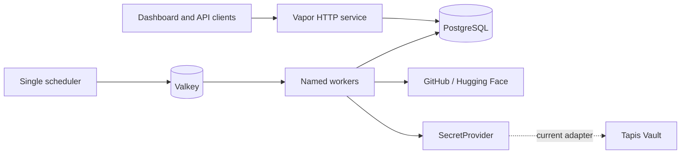

# Architecture

How the parts fit, and why they are separate. For developers.

Insights keeps HTTP delivery, scheduling, queue execution, persistence, platform APIs, and
credential storage apart, so each can change or scale on its own.



## Three processes

The same binary, started three ways.

| Process | Owns | Does not own |
|---|---|---|
| `serve` | HTTP decoding, validation, responses | Any job execution |
| `queues --scheduled` | Deciding when work begins | Slow platform calls |
| `queues --queue metrics` | Claiming and executing jobs | Clock evaluation |

The split exists so a slow platform API cannot delay the scheduler's next tick, and so throughput
scales by adding workers rather than by making one process bigger.

## Why the scheduler is alone

Vapor's scheduler has no distributed leader lock. Two replicas run the same clocks and enqueue the
same work twice. Workers have no such problem, because Valkey moves each available payload to
exactly one consumer atomically.

That asymmetry is the whole scaling story: **drainers scale horizontally, the scheduler stays at
one**.

Atomic claiming is not exactly-once execution. A worker can fail after calling a platform but
before acknowledging the payload, and the job runs again. Jobs must be safe to retry.

## Why jobs live in Valkey

The worker's poll is a blocking pop rather than a table scan on every tick, and there is no jobs
table to migrate. Any Redis-protocol server works. Valkey also backs the rate-limit counters, so
limits hold across replicas instead of being granted afresh by each one.

## The composition root

`configure.swift` is the one place a concrete backend is chosen. Everything else depends on a
protocol or a framework abstraction.

Jobs call `application.secrets` and never mention Tapis. Adding a second credential backend is one
`case` in that switch, not a change to every consumer. The same holds for `FailureNotifier`.

Both seams exist because each had a real second implementation. Neither was added speculatively.

## Request path

A request passes through, in order:

1. Security headers, CORS, and request ID
2. `ErrorMiddleware`
3. `FileMiddleware`
4. Rate limiter, keyed on client address
5. Both authenticators
6. `Require`, on routes that have one
7. The controller

The first group registers `at: .beginning`, ahead of `ErrorMiddleware`. Response headers are
stamped on the way back out, so a middleware added later never sees an error response — and a 4xx
without CORS headers is unreadable to the browser that caused it.

The two authenticators populate the request's identity and **never reject**. `Require`, attached
per route inside each controller, is the only place 401 and 403 are produced. A route without a
`Require` is public by construction, which is what serves the dashboard to anonymous visitors.

Health probes sit outside `/api`, so orchestrator polling is neither rate limited nor
authenticated.

## Source layout

```text
Sources/Insights/
├── Commands/       one-shot operator commands
├── Controllers/    HTTP boundaries and health probes
├── DTOs/           request and public response shapes
├── Errors/         configuration and job failures
├── Middlewares/    authenticators, Require, limits, headers, request IDs
├── Migrations/     schema and the development seed
├── Models/         Fluent persistence
├── Queues/         scheduled sweeps, jobs, routing, watermark folds
├── Services/
│   ├── Admins/         who holds administrative access
│   ├── Notifications/  failure alerting
│   ├── Secrets/        the provider-neutral credential contract
│   ├── ServiceTokens/  webhook token issuing and signing keys
│   └── Tapis/          the Tapis Vault adapter
└── configure.swift composition root
```

`Middlewares/` holds things conforming to `AsyncMiddleware` or `AsyncBearerAuthenticator`, plus the
identities they produce. Anything that merely hangs off `Application` belongs with the domain it
serves: signing-key lifecycle sits beside the issuer that uses it, admin resolution beside the
model it reads. That is where someone looks for it.

Tapis specifics stay inside `Services/Tapis/` and the two authenticators, so a future adapter is an
addition rather than an untangling.

Read [Invariants](../reference/invariants.md) before changing how these parts interact.

#icicle-insights# #Explanation# #Developer# #architecture#
