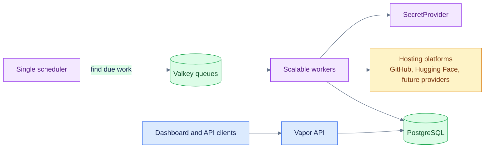
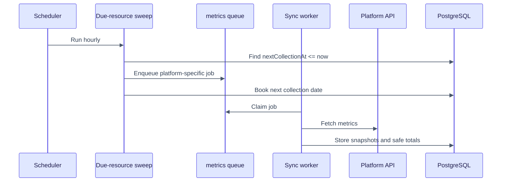
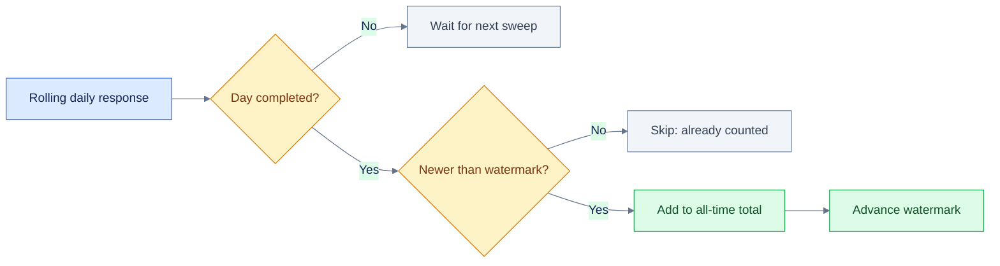
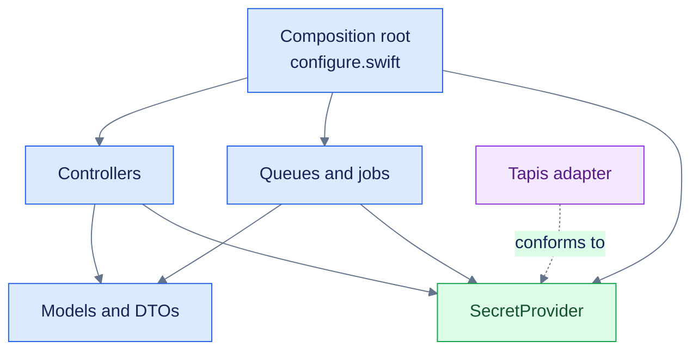
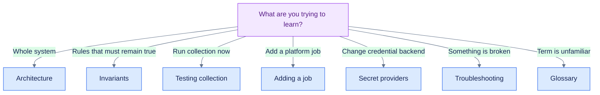

# Welcome to ICICLE Insights

ICICLE Insights measures the reach of open-source work across hosting platforms. It collects
signals such as stars, forks, clones, views, downloads, likes, and followers; preserves their
history; and serves the results through a Vapor API and dashboard.

Built for the ICICLE research ecosystem, its core model is intentionally general-purpose:

```text
platform account → published resource → metric history
```

Platform credentials are resolved through the `SecretProvider` application service. The
composition root selects a credential adapter; the included configuration selects Tapis Vault.

## The system in one picture



There is one scheduler because duplicate schedulers can dispatch the same work twice. Queue
workers can scale horizontally because Valkey atomically assigns each available payload to one
worker. Delivery remains at-least-once, so jobs must still be safe to retry.

## The collection story



The hourly sweep is only a scanner. A resource normally runs every seven days—or its configured
cadence—not every hour. Account followers use a separate monthly dispatcher because they belong
to an account rather than an individual resource.

## Why watermarks exist

Some APIs return overlapping recent windows instead of new deltas. Adding every response would
count the shared days repeatedly. A watermark remembers the newest completed day already added.



Read [watermarks.md](watermarks.md) when you want the full worked example.

## How the code is organized



- `Controllers/` owns HTTP boundaries.
- `Queues/` owns dispatch, workers, provider translation, and watermark folds.
- `Models/` and `DTOs/` own persisted and public data shapes.
- `Services/Secrets/` owns the provider-neutral credential boundary.
- `Services/Tapis/` is one secret-provider adapter.
- `configure.swift` selects concrete infrastructure once.

## Choose your path



- Start with [architecture.md](architecture.md) for component ownership and lifecycles.
- Read [invariants.md](invariants.md) before refactoring core behavior.
- Use [testing-collection.md](testing-collection.md) to run jobs without changing schedules.
- Use [jobs.md](jobs.md) to implement another collector.
- Use [secret-providers.md](secret-providers.md) to add or switch credential backends.
- Use [troubleshooting.md](troubleshooting.md) for symptom-driven diagnosis.
- Browse [README.md](README.md) for the complete handbook index.

## Preserving design intent

These guides explain intent alongside mechanics. Architecture decision records under
[`decisions/`](decisions/) preserve the reasoning behind important choices. Review the relevant
invariant and decision record before changing a queue, watermark, lock, or service boundary.

#icicle-insights# #introduction# #architecture# #developer-documentation#
