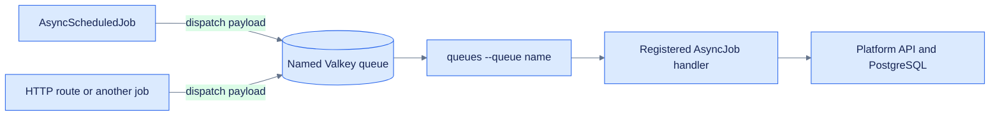

# Adding a job

How a job gets from a file to a worker actually running it. Companion to
[collection.md](collection.md), which covers *why* the metrics are shaped the way they are.



## The three files

Adding a platform sync connects three files. Registration gives workers a decoder and handler;
routing places the typed payload on the correct queue.

| # | File | What it does |
|---|---|---|
| 1 | `Sources/Insights/Queues/SyncXStats.swift` | The work itself |
| 2 | `Sources/Insights/configure.swift` | `app.queues.add(...)` — maps the job's name to a decoder |
| 3 | `Sources/Insights/Queues/Queue+SyncDispatch.swift` | Routes a platform to the job |

**Controllers need no change.** `ResourceController.create` and `CollectDueResources` both call
`dispatchSync(for:platform:logger:)`, so wiring the platform in step 3 gets you create-time
collection and the hourly sweep at once. That is the reason the routing lives in one extension
rather than at each call site.

### 1. The job

```swift
import Fluent
import Foundation
import Queues
import Vapor

/// Payloads are values on a queue, not references — only the id crosses. The job re-reads the
/// row, so a resource edited between dispatch and dequeue is synced as it is now.
struct GHCRResource: Codable {
  let id: UUID
}

struct SyncGHCRStats: AsyncJob {
  typealias Payload = GHCRResource
  let baseUrl = "https://github.com/orgs"

  func dequeue(_ context: QueueContext, _ payload: GHCRResource) async throws {
    guard
      let resource = try await Resource.query(on: context.application.db)
        .filter(\.$id == payload.id)
        .with(\.$account)
        .first()
    else {
      throw JobError.entryNotFound(id: payload.id)
    }

    // fetch, then write
  }
}
```

Conventions the existing jobs follow:

- **Fetch everything, then write.** `SyncGitHubRepoStats` collects all three responses before
  creating a single `Metric` batch, so a failure partway through leaves no half-swept resource —
  gauges stranded without the traffic rows that share their timestamp. There's a test for this.
- **Express failures as `JobError`.** The four cases in `Sources/Insights/Errors/JobError.swift`
  (`entryNotFound`, `missingToken`, `apiRequestFailed`, `decodingFailed`) are what the tests
  pattern-match on. A thrown error also leaves `nextCollectionAt` untouched, so the next sweep
  retries the resource instead of skipping ahead an interval.
- **`error(_:_:_:)` is optional.** Worker logging currently provides the failure record.
- **Token, if the API needs one.** Look up the account's `Vault`, then
  `context.application.secrets.readSecret(named:)`. The selected `SecretProvider` resolves it.
  Public endpoints, such as GHCR package pages, can omit credential lookup and the associated
  `missingToken` failure mode.

### 2. Register the handler — `configure.swift`

```swift
let syncGHCRStats = SyncGHCRStats()
app.queues.add(syncGHCRStats)
```

`add` is what lets a worker turn a queued id back into a typed payload and a handler. Without
it the dispatch still succeeds — the failure surfaces on the *worker*, at dequeue time, as an
unknown job name.

### 3. Route the platform — `Queue+SyncDispatch.swift`

```swift
case .ghcr:
  try await dispatch(SyncGHCRStats.self, .init(id: id))
case .npm, .pypi:
  logger.debug("No sync job for platform; skipping resource", metadata: [...])
```

Platforms without a job are listed in the skip branch rather than throwing: they are
legitimately in the catalog, just not collectable. The `switch` is exhaustive over `Platform`,
so adding a platform forces you to decide which branch it belongs in.

## Choosing the all-time handling

This is the decision that gets metrics wrong if rushed. Match the API's shape to a helper:

| The API reports | Store as | All-time helper |
|---|---|---|
| Current value (stars, forks, likes) | `.stars` etc. | **none** — `MetricType.allTime` is nil, the series *is* the record |
| Overlapping window **with a per-day array** (GitHub traffic) | the window count | `Metric.foldDailyIntoAllTime` |
| Overlapping window, no per-day array, but a lifetime total alongside (the Hub) | the window count | `Metric.setAllTime` with the reported total |
| A lifetime total only (likely GHCR pulls) | `.pullsAllTime` directly | **none** — it is already the total |

`Metric.addToAllTime` accumulates and is only safe for genuine deltas. No current job calls it
directly; `foldDailyIntoAllTime` uses it internally once it has filtered the days down to ones
never counted before. Feeding it a rolling window is the bug
[collection.md](collection.md#why-rolling-windows-need-special-handling) explains the failure
mode in detail.

## Adding a new platform, metric type, or resource type

All three are Postgres enums, created in `FirstMigration`. Adding a Swift case is not enough —
an insert with an unknown value fails at the database. You need a new additive migration:

```swift
try await database.enum("metric_type").case("newThing").update()
```

Then register it in `configure.swift` **after** the existing migrations, and, for a new
`MetricType`, decide whether it needs a case in `MetricType.allTime`. For a new `Platform`, also
set its `maxCollectionIntervalDays` in `Account.swift` — the longest sweep interval that still
loses no days, which `ResourceController.create` enforces.

## Scheduled jobs vs. jobs

For the deployment and container decision—especially when a new named queue needs its own
worker—see [queue-workers.md](queue-workers.md).

Two different protocols, two different workers:

- **`AsyncJob`** — dispatched with a payload, drained by `queues --queue metrics`.
- **`AsyncScheduledJob`** — no payload, run on a clock by `queues --scheduled`.

The scheduled jobs here (`CollectDueResources`, `CollectAccountStats`) only *enqueue*; the
actual syncing happens on the metrics queue. That split is deliberate: a slow sync can't delay
the next sweep. Schedule a new one in `configure.swift`:

```swift
app.queues.schedule(MySweep()).hourly().at(0)
```

Run exactly one scheduler process. Two would dispatch every due resource twice.

Note the two sweeps differ by *unit*: `CollectDueResources` is per-resource and interval-driven,
`CollectAccountStats` is per-account and fixed-monthly. An account-level figure folded into the
resource sweep would be fetched once per resource the account owns.

## Running it

```
just queues      # queues --queue metrics    — drains the syncs
just scheduled   # queues --scheduled        — runs the sweeps
```

`serve` does **not** drain the queue. Jobs live in Valkey/Redis (`REDIS_HOST`), so a dispatch
with nothing listening fails at dispatch time rather than queueing silently.

To exercise one job without waiting for a sweep, dispatch it from a route or call `dequeue`
directly from a test — which is what the sync tests do.

## Tests

Two suites cover different halves, and they need the `test` database (`just db`, then
`just test` — serial, because every suite migrates and reverts the shared database).

**`SyncJobTests`** drives a job's `dequeue` directly against a stubbed client. Add a case there
for a new job:

- `stubAPI(on:_:token:)` replaces both `app.client` and `app.secrets`, answers Vault reads
  automatically from the secret name in the URL, and returns a recording of every request — that
  recording is how the URL spelling gets pinned (`/orgs/` vs `/org/`, `expand[]` parameters).
- Routes match on **exact path**, query excluded, because GitHub's paths nest: `/repos/o/n` is a
  prefix of `/repos/o/n/traffic/clones`. Unmatched requests answer 404, so a job asking for
  something the test didn't anticipate fails loudly.
- Bodies are served as `application/json`. A scraped HTML endpoint needs a variant of the stub.
- Traffic days must be generated relative to now (`trafficJSON`), never hard-coded — the fold
  compares against today's UTC midnight, so fixed dates drift out of the window and silently
  stop being folded.

**`QueueSweepTests`** covers the routing and scheduling instead, using the in-memory driver via
`withQueueApp`, so it asserts *which* job a platform dispatches without running it:

```swift
#expect(app.queues.asyncTest.all(SyncGitHubRepoStats.self).map(\.id) == [try repo.requireID()])
```

Add a case here when you wire a platform into `dispatchSync` — this is the suite that would have
caught a job registered but never routed.

## Checklist

- [ ] Job file in `Sources/Insights/Queues/`, throwing `JobError`, writing after all fetches
- [ ] `app.queues.add(...)` in `configure.swift`
- [ ] Platform case in `Queue+SyncDispatch.swift`
- [ ] All-time handling matches the API's shape (table above)
- [ ] Migration for any new enum case, plus `maxCollectionIntervalDays` for a new platform
- [ ] `SyncJobTests` case for the happy path and at least one failure
- [ ] `QueueSweepTests` case for the routing
- [ ] `just fmt`

#icicle-insights# #queues# #background-jobs# #platform-integrations# #developer-documentation#
