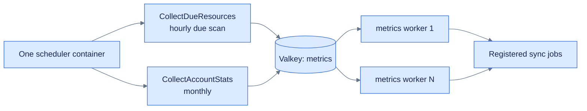

# Queue workers and schedulers

How to decide whether a new job needs another process, and how to run that process with
Apple Container or Docker Compose. For implementing a platform sync job itself, see
[jobs.md](jobs.md).

## The short rule

There are three different roles in this application:

| Role | Command | Responsibility | How many? |
|---|---|---|---|
| HTTP server | `Insights serve ...` | Handles API and dashboard requests | One or more |
| Scheduler | `Insights queues --scheduled` | Runs every registered clock-based schedule | **Exactly one** |
| Named worker | `Insights queues --queue <name>` | Drains one named queue | At least one per queue name in use |

Adding another `AsyncScheduledJob` does **not** require another scheduler container. Register it
with `app.queues.schedule(...)`, and the existing `--scheduled` process runs it alongside all the
other schedules.

Adding another `AsyncJob` usually does **not** require another worker either. If it is dispatched
onto the existing `metrics` queue, the existing `--queue metrics` worker processes it.

Add a new worker service only when the job is intentionally dispatched to a **new queue name**,
such as `emails`, `exports`, or `maintenance`.

## How the current metrics flow works



Scheduled jobs stay small: they query for work and enqueue typed jobs. Workers own remote API
requests, so a slow synchronization cannot delay the scheduler's next tick.

Valkey stores the queued payloads. PostgreSQL stores application data and collection due dates.
The HTTP server handles requests independently from the queue workers.

## Current scheduling matrix

All clock expressions are registered in `Sources/Insights/configure.swift`. The single
`insights-scheduled` container evaluates them; `insights-queues` executes everything dispatched
to the `metrics` queue.

| Platform / scope | Dispatcher | Clock and eligibility | Executed job | Queue / worker | Metric state behavior |
|---|---|---|---|---|---|
| GitHub repository resources | `CollectDueResources` | Sweep hourly at minute `00`; each resource runs only when `nextCollectionAt <= now`. Its configured interval defaults to 7 days and is capped at 14. | `SyncGitHubRepoStats` | `metrics` / `queues --queue metrics` | Stars, forks, and subscribers are snapshots. Clone/view daily values fold into all-time rows through `MetricWatermark`, excluding the incomplete UTC day. |
| Hugging Face resources | `CollectDueResources` | Same hourly due-resource sweep; interval defaults to 7 days and is capped at 30. | `SyncHuggingFaceHubStats` | `metrics` / `queues --queue metrics` | Likes and rolling downloads are snapshots; the provider's lifetime downloads value replaces the stored all-time value with `setAllTime`. No daily watermark is needed. |
| GitHub accounts | `CollectAccountStats` | First day of every month at 03:00; every GitHub account is eligible because accounts have no `nextCollectionAt`. | `SyncGitHubOrgStats` | `metrics` / `queues --queue metrics` | Followers are a current-value snapshot. No watermark or resource interval applies. |
| GHCR resources | Planned | Awaiting schedule and dispatch routing. | `SyncGHCRStats` prototype | Queue pending | Activation requires registration, routing, tests, and a queue decision for the HTML-scraping workload. |
| npm resources | None | Not scheduled; `dispatchSync` logs and skips them. | None | None | No collection implementation yet. |
| PyPI resources | None | Not scheduled; `dispatchSync` logs and skips them. | None | None | No collection implementation yet. |

The hourly resource schedule is a due-work scanner. After a successful dispatch,
`scheduleNextCollection(from:)` advances that
resource by `collectionIntervalDays`. The scheduler can therefore support different per-resource
cadences without registering a separate clock for each platform.

The `ResourceController.create` handler dispatches a resource sync immediately and then books
its next collection date. The POST route currently awaits authentication and authorization;
enabling the route activates creation-time dispatch.

Schedule times use the scheduler process's calendar/time zone. Container deployments should set
and document an explicit `TZ` value if 03:00 must mean a particular local zone; otherwise treat
the deployment's configured zone as authoritative.

## Adding a scheduled job

Use an `AsyncScheduledJob` when work begins on a clock rather than from an HTTP request or
another job:

```swift
struct RemoveExpiredData: AsyncScheduledJob {
  func run(context: QueueContext) async throws {
    // Query for work and preferably dispatch jobs to a named queue.
  }
}
```

Register its cadence in `Sources/Insights/configure.swift`:

```swift
app.queues.schedule(RemoveExpiredData()).daily().at(2, 30)
```

That is the only container-related step. The existing services already run:

```console
Insights queues --scheduled
```

Do not create one scheduler per scheduled job. Multiple scheduler replicas run the same set of
schedules and can dispatch duplicate work. Keep the scheduler at one replica unless the jobs
have explicit distributed locking and are designed for concurrent scheduling.

## Adding a job to the existing `metrics` queue

An `AsyncJob` needs to be registered so the worker can decode and execute its payload:

```swift
app.queues.add(SyncNewPlatformStats())
```

Dispatch it through the existing queue:

```swift
try await context.queues(.metrics).dispatch(
  SyncNewPlatformStats.self,
  .init(id: id)
)
```

The existing worker already covers this job type:

```console
Insights queues --queue metrics
```

One worker can execute every registered job type placed on `metrics`; workers are selected by
queue name, not by Swift job type.

## When to create a new named queue

A separate queue is useful when one workload needs independent concurrency, scaling, resource
limits, or failure isolation. Examples include:

- slow exports that should not delay metric collection;
- email work that needs different retry or scaling behavior;
- CPU-heavy jobs that deserve their own container limits;
- high-priority work that must not sit behind a large metrics backlog.

A new job type can share an existing queue. Introduce another named queue when its independent
scaling, isolation, or resource policy justifies another worker service.

### 1. Define and dispatch to the queue

If the queue-name extension does not already contain the new name, add it using the Queues API
convention used by the project, then dispatch explicitly:

```swift
try await context.queues(.exports).dispatch(
  BuildExport.self,
  .init(id: id)
)
```

Register `BuildExport` with `app.queues.add(...)` as usual.

### 2. Add an Apple Container worker recipe

Copy the structure of the `queues` recipe in `justfiles/apple-container.just`, but give the
container and queue distinct names:

```just
exports: build
    container stop insights-exports >/dev/null 2>&1 || true
    container delete insights-exports >/dev/null 2>&1 || true
    container run --detach --name insights-exports \
        --network '{{container_network}}' \
        --env-file .env \
        --env-file .env.container \
        --env DATABASE_HOST="$(container inspect insights-db | jq -r '.[0].status.networks[0].ipv4Address | split("/")[0]')" \
        --env REDIS_HOST="$(container inspect insights-valkey | jq -r '.[0].status.networks[0].ipv4Address | split("/")[0]')" \
        '{{container_image}}' queues --queue exports
```

Then add `exports` to the `stack` dependency list and `insights-exports` to the loop in `stop`.
The two environment files are intentional: `.env` selects and configures the secret provider,
while `.env.container` overrides database and Valkey settings with safe local
values. The recipes inject the current container IPs because Apple Container 1.0.0 does not
reliably resolve peer container names on the custom network.

### 3. Add a Docker Compose worker service

Add a service using the shared environment and the new queue name:

```yaml
  exports:
    image: insights:latest
    build:
      context: .
    environment:
      <<: *shared_environment
    depends_on:
      - db
      - valkey
    command: ["queues", "--queue", "exports"]
```

Compose starts this service with `docker compose up`. No new Valkey instance or database is
needed; all named queues can share the existing Valkey service.

## Scaling workers

It is safe to run multiple workers for the same named queue when more throughput is needed.
Valkey atomically moves a queued payload to one worker's processing list, so two workers cannot
claim the same available payload at the same time. No application-level coordination or queue
configuration is required: both processes consume the same named list. Scale the worker, not
the scheduler:

```console
docker compose up --scale queues=3
```

For deployments that honor the Compose `deploy` section, a fixed replica count can also be
recorded on the worker service:

```yaml
  queues:
    # image, environment, dependencies, etc.
    command: ["queues", "--queue", "metrics"]
    deploy:
      replicas: 2
```

For Apple Container, create multiple containers with unique names that all execute
`queues --queue metrics`:

```console
container run --detach --name insights-queues-1 ... \
  icicle-insights queues --queue metrics
container run --detach --name insights-queues-2 ... \
  icicle-insights queues --queue metrics
```

Each Apple container is a lightweight VM with its own configured CPU and memory allocation. On
an orchestrated deployment, scale worker replicas with the same image, command, and queue name.

Atomic claiming does **not** mean exactly-once execution. A worker can fail after an external
side effect but before acknowledging the payload, and retry handling can execute it again.
Jobs must remain safe to retry.

Horizontal workers also introduce real concurrency. This project's
`Metric.foldDailyIntoAllTime` takes a PostgreSQL advisory transaction lock keyed by resource and
metric type, so two folds cannot corrupt the same all-time value while unrelated resources can
still proceed concurrently. New read-modify-write jobs need equivalent concurrency protection.

Worker scaling has two practical limits:

- They consume a provider's API allowance concurrently. GitHub 403 responses or an exhausted
  `x-ratelimit-remaining` value call for throttling or delayed retries, not more workers.
- A single shared queue still has head-of-line pressure: a backlog of slow HTML-scraping jobs
  can delay API jobs. Split by provider/workload when independent scaling or isolation becomes
  valuable; job type alone is not a reason to create another queue.

The resulting rule is: **drainers scale horizontally; the scheduler stays single-replica**.

## Testing and observing

Start the complete local Apple Container stack:

```console
just stack
```

Inspect each role independently:

```console
container logs -f insights-scheduled
container logs -f insights-queues
container logs -f insights-app
container exec insights-valkey valkey-cli ping
```

The scheduler only runs a scheduled job when its registered clock fires. For resource metrics,
`CollectDueResources` additionally selects only rows whose `nextCollectionAt` is in the past.
Changing a resource's `collectionIntervalDays` does not make it immediately due; it controls the
next date assigned after a successful collection.

### Run collection immediately during local testing

Use the one-shot recipes rather than editing and restoring production schedules:

```console
just collect-now           # resources whose nextCollectionAt is already due
just collect-all-now       # force every active resource due, then dispatch
just collect-accounts-now  # run the monthly account dispatcher once
```

Immediate runs still use metric watermarks. Triggering controls *when* a sync is enqueued;
`Metric.foldDailyIntoAllTime` still decides which completed daily values are new. The complete
test procedure, database effects, log commands, and native equivalents are in
[testing-collection.md](testing-collection.md).

For automated tests, call a job's `dequeue` or scheduled job's `run` directly with test
contexts, as the existing queue suites do. For local manual testing, prefer a dedicated one-shot
application command that invokes the same scheduled-job code over temporarily changing the
production cadence in `configure.swift`.

## Deployment checklist

When adding queue work, ask these in order:

- [ ] Is it an `AsyncScheduledJob` or an `AsyncJob`?
- [ ] Is every `AsyncJob` registered with `app.queues.add(...)`?
- [ ] Is every scheduled job registered once with `app.queues.schedule(...)`?
- [ ] Which named queue receives the dispatched job?
- [ ] Does that queue already have a worker service?
- [ ] If the queue is new, was a worker added to both Apple Container and Compose?
- [ ] If the queue is new, was it added to Apple Container `stack` and `stop`?
- [ ] Is there still exactly one scheduler replica?
- [ ] Can the job safely retry without corrupting or duplicating data?
- [ ] Are scheduler and worker logs visible in the deployment?

#icicle-insights# #queues# #scheduling# #containers# #operations# #developer-documentation#
