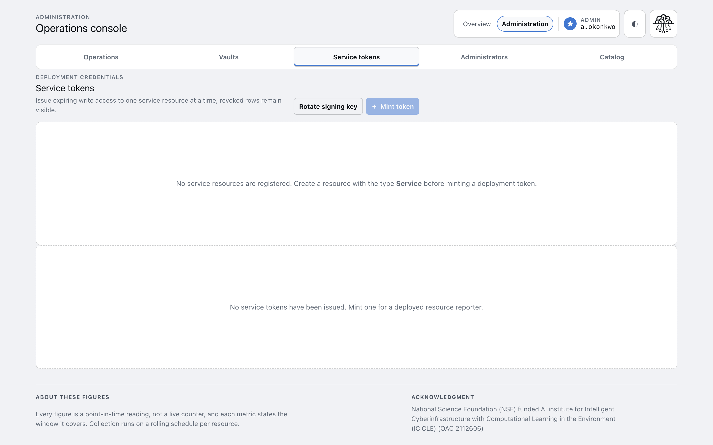
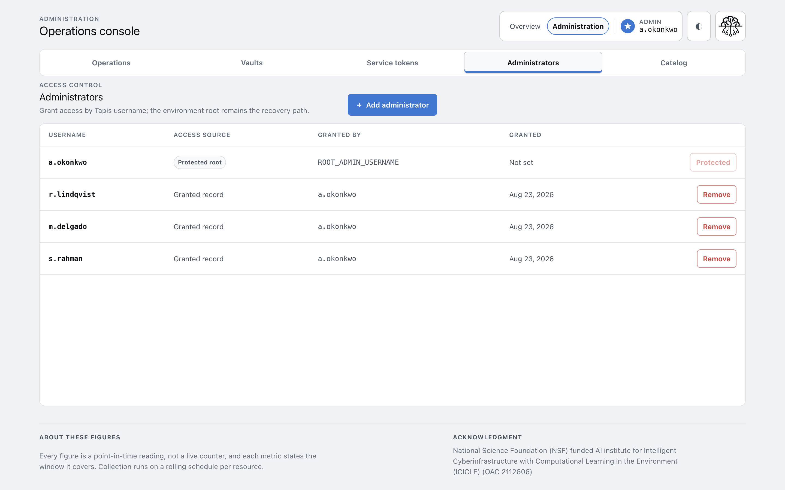

# Admin console

Every screen in the console, and what each one shows. For administrators.

The console lives at `/admin`. It appears only for administrators; everyone else sees the public
dashboard. Access is confirmed by the API on every load, never inferred from the token.

Two top-level modes sit in the header: **Overview** is the public dashboard, **Administration** is
the console.

## Operations

`/admin` — the landing screen. Read it first when something looks wrong.

Four status tiles across the top:

| Tile | Reads | Clear when |
|---|---|---|
| Collections on schedule | Resources collected recently, out of the total | Nothing is overdue |
| Collection pipeline | Jobs waiting, running, and failures in 7 days | Scheduler online, queue draining |
| Vault credentials healthy | Live credentials, out of the total | None expired or expiring within 30 days |
| Active service tokens | Live webhook tokens | None expiring within 30 days |

The **Operational watchlist** below lists anything needing review, most urgent first. Empty is the
healthy state.

**Administrator context** on the right reports the current session: identity, where the token came
from, scheduler heartbeat, watermark count, recent job failures, and the administrator count.
A stale scheduler timestamp is the first sign collection has stopped.

## Catalog

`/admin/catalog` — what Insights collects. Four tabs.

### Accounts

A platform account owns resources and at most one vault credential.

| Column | Meaning |
|---|---|
| Account | Name on the platform |
| Registry | GitHub, GHCR, Hugging Face, npm, PyPI, or Patra |
| Resources | How many resources this account owns |
| Vault | Whether a credential is configured |
| Created | When the account was registered |

See [Register an account](../how-to/register-an-account.md).

### Resources

Each resource belongs to one account and carries its own collection cadence.

| Column | Meaning |
|---|---|
| Resource | Name on the platform |
| Kind | Agent, container, dataset, model, package, repository, or service |
| Account | Owning account |
| Cadence | Days between successful collections. Default 7 |
| Next collection | When it next becomes eligible. `Not set` means it is never swept |

Cadence is capped per platform, at half that platform's retention window where one exists. See
[Collection schedule](collection-schedule.md) and [Add a resource](../how-to/add-a-resource.md).

### Releases and Metrics

Two further tabs list published releases and individual metric readings. Both are read-mostly;
readings normally arrive from collection rather than by hand.

## Vaults

`/admin/vaults` — platform credentials, by metadata only.

| Column | Meaning |
|---|---|
| Credential | Name of the secret in Tapis Vault, generated from the account and registry |
| Account | Which account uses it |
| Expires | Operational expiry you recorded |
| Last rotated | When the value was last written |

Adding one asks for three things: the account, the platform token, and an expiry date. The name is
derived rather than entered, and previewed before you save. Only accounts without a credential
appear in the picker, so there is at most one per account.

**Secret values are never returned to this screen.** The rows hold names and dates. The value
lives in Tapis Vault and is read in-process by collection jobs.

**Rotate** replaces the stored value and records a new expiry in one operation.

## Service tokens

`/admin/service-tokens` — write access for deployed services.

A service token lets one deployed service post metrics for exactly one resource. Minting asks for
the resource, a deployment label, and a lifetime in days — 1 to 365, defaulting to 90. Tokens can be
revoked immediately.

Tokens can only be minted for a resource whose kind is **Service**. With none registered, the
screen says so rather than offering an unusable form.

Two controls sit at the top:

| Control | Does |
|---|---|
| Mint token | Issues a token for one service resource. Shown once, never again |
| Rotate signing key | Adds a new signing key. Existing tokens keep working |

Revoked rows stay visible as an audit trail. See
[Issue a service token](../how-to/issue-a-service-token.md).

## Administrators

`/admin/administrators` — who holds administrator access.

*Usernames in this screenshot are placeholders.*

| Column | Meaning |
|---|---|
| Username | Tapis username |
| Access source | `Protected root` for the environment root, `Granted record` for everyone else |
| Granted by | Who added them, or `ROOT_ADMIN_USERNAME` for the root |
| Granted | When |

The root administrator comes from `ROOT_ADMIN_USERNAME` and **cannot be removed here**. It is the
recovery path: administrators are managed from this screen, so deleting the last row would
otherwise lock everyone out of the screen needed to fix it.

Revocation takes effect on the next request, not at the next restart. See
[Manage administrators](../how-to/manage-administrators.md).

## Public dashboard

`/` — what an anonymous visitor sees. Four tabs.

| Tab | Shows |
|---|---|
| Portfolio | Resource mix, and all-time totals per metric |
| Top Resources | Ranked reach across resources |
| Trends | Change over time, per metric, over a chosen window |
| Releases | Published release history |
| Provenance | Resources Patra recorded as the same artifact under another registry |

Every figure is a point-in-time reading rather than a live counter, and each states the window it
covers.

#icicle-insights# #Reference# #Administrator# #console#
