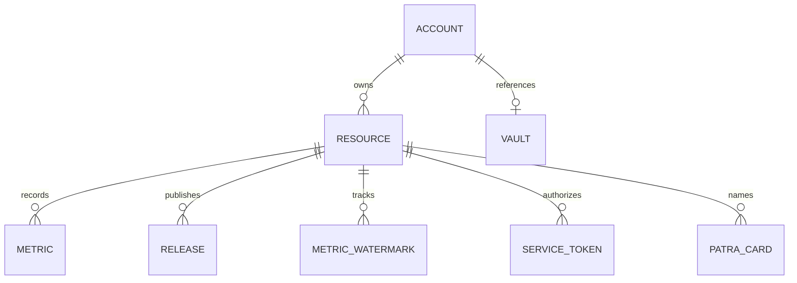

# Data model

Tables, relationships, and enumerations. For developers.



## Tables

| Table | Holds |
|---|---|
| `accounts` | Platform identities that own resources |
| `resources` | The things being measured, and their collection cadence |
| `metrics` | Individual readings, one row per sweep per metric |
| `metric_watermarks` | Newest completed day already folded into an all-time total |
| `releases` | Published versions |
| `patra_cards` | One (name, version) card per Patra model or datasheet, with cross-registry links |
| `vaults` | References to credentials stored outside PostgreSQL |
| `service_tokens` | Webhook token identifiers and metadata |
| `admins` | Granted administrator access |
| `job_failures` | Durable record of failed collection jobs |

## Key fields

**`resources`**

| Field | Meaning |
|---|---|
| `next_collection_at` | When this resource may next be dispatched. Null means never |
| `collection_interval_days` | Spacing booked after a successful dispatch. Default 7 |
| `last_collected_at` | When a collection last *succeeded*. Null until the first one |
| `stall_notified_at` | When the retention-window alert last fired. Cleared on the next success |

**`metric_watermarks`** — one row per `(resource, metric type)`.

| Field | Meaning |
|---|---|
| `counted_through` | Newest completed UTC day already added to the all-time total |

`next_collection_at` and `counted_through` answer different questions: *when to fetch next* versus
*what has already been counted*. Keeping them apart is what lets a late sweep resume exactly where
the last one stopped.

**`patra_cards`** — one row per Patra card, child of `resources`. A Patra card names a (name,
version) pair, not a distinct model, so one resource commonly owns several.

| Field | Meaning |
|---|---|
| `card_uuid` | Patra's own identifier. Unique — the only stable key; name alone is not |
| `version` | The card's version string, as Patra reports it. Not exposed by the API |
| `card_updated_at` | The card's own `updated_at`, as Patra reports it |
| `source_url` | The chosen cross-registry identifier for the artifact. Stored even when it resolves to nothing |
| `hub_resource_id` | The Hugging Face resource `source_url` names, when it resolves |
| `repository_resource_id` | The GitHub (or other code host) resource `source_url` names, when it resolves |
| `training_datasheet_uuid` | Patra's model-to-datasheet link. Stored, unused by the API today |

`source_url` is a model card's raw `ai_model.location` for a model. For a dataset it is the one
datasheet identifier `SyncPatraCatalog` chose to trust.

A datasheet lists several DataCite-style identifiers. Most name a *different* artifact that only
cites it. Only an `alternate_identifier` of type `HuggingFace`, or a `related_identifier` whose
`relation_type` is `IsVariantFormOf` or `IsIdenticalTo`, counts as the same artifact elsewhere. See
`SyncPatraCatalog.resolveDatasheetProvenance` for the full rule.

**`service_tokens`**

| Field | Meaning |
|---|---|
| `jti` | Random token identifier. Resolved against a live row on every request |
| `label` | Human name for the token |
| `expires_at` | Set at minting from the chosen lifetime. Default 90 days, range 1–365 |
| `revoked_at` | Set on revocation. The row is retained as an audit trail |

**The row holds no credential.** Identifiers and metadata only.

## Enumerations

**Platform** — on `accounts`, and what collection routes on.

```
github  ghcr  huggingface  npm  pypi  patra
```

**Resource kind** — on `resources`. Describes what a thing is, not which API reports on it.

```
agent  container  dataset  model  package  repository  service
```

Only a resource of kind `service` can be issued a webhook token. `agent` can be registered by hand
but nothing in the API publishes one yet — see [TODO](../../TODO.md).

**Metric type** — on `metrics`.

```
authentications  clones  deployments  downloads  forks  likes  pulls  stars  subscribers  views
authenticationsAllTime  clonesAllTime  downloadsAllTime  pullsAllTime  viewsAllTime
```

The `*AllTime` variants cannot be written directly through the API. They are maintained by the
fold. See [Watermarks](../explanation/watermarks.md). `deployments` has no `*AllTime` twin: Patra's
count is already a lifetime total, read whole on every sweep, so there is no window to fold.

## Migrations

Applied in order, all registered in `configure.swift`.

| Migration | Adds |
|---|---|
| `FirstMigration` | Accounts, resources, metrics, releases, vaults |
| `RecurringCollection` | Collection due dates and watermarks |
| `ServiceTokens` | Webhook token rows |
| `Admins` | Granted administrator access |
| `JobFailures` | Durable failure records |
| `CollectionBackoff` | Collection history, and clamps GitHub cadences to the current cap |
| `PatraPlatform` | The `patra`, `agent`, and `deployments` enum values, and `patra_cards` |
| `ICICLESnapshotJuly2026` | Seed data. **Development only** |
| `PatraCatalogAugust2026` | Seed data. **Development only** |

Both seed migrations are registered only when `VAPOR_ENV=development`, so they target `dev` and
can never reach `test` or a deployment.

## Database by environment

| Environment | Database |
|---|---|
| testing | `test` |
| development | `DATABASE_NAME`, else `dev` |
| production | `DATABASE_NAME`, else `vapor_database` |

Tests always hit `test`, so a stray run cannot clobber development or production data.

#icicle-insights# #Reference# #Developer# #data-model#
