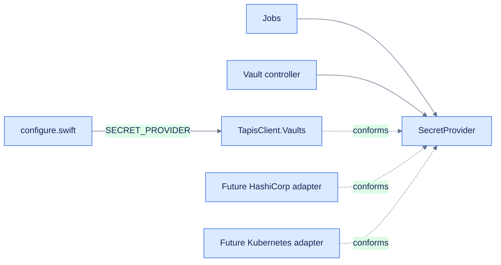

# Secret providers

`SecretProvider` gives collection jobs and Vault controllers one stable interface for named
credentials. Adapters own backend authentication, payloads, and error translation.



## Contract

```swift
protocol SecretProvider: Sendable {
  func readSecret(named name: String) async throws -> Secret
  func writeSecret(named name: String, secret: String) async throws
  func destroySecret(named name: String) async throws
}
```

`Secret` redacts string conversion, debug output, and reflection. Calling
`getSecretValue()` is intentionally explicit and should happen only while building an
authenticated outbound request.

## Current provider

Set:

```dotenv
SECRET_PROVIDER=tapis
TAPIS_BASE_URL=https://example.tapis.io
TAPIS_TENANT=example
TAPIS_USER=service-user
TAPIS_TOKEN=replace-me
```

`configure.swift` constructs `TapisClient.Vaults` and stores it as `application.secrets`.
Unsupported `SECRET_PROVIDER` values fail at startup rather than later in a job.

## Add a provider

1. Create `Sources/Insights/Services/<Provider>/<Provider>SecretProvider.swift`.
2. Conform to `SecretProvider`; translate backend payloads and authentication internally.
3. Wrap every resolved value in `Secret` so redaction remains consistent.
4. Add provider-specific configuration with fail-fast validation.
5. Add one `case` to the provider switch in `configure.swift`.
6. Add unit tests for success, not found, authentication failure, malformed response, writes,
   and destruction.
7. Document how existing secret names are provisioned or migrated.

Existing controllers and queue jobs continue using the same application service.

```swift
case "example":
  app.secrets = try ExampleSecretProvider.fromEnvironment(client: app.client)
```

## Read-only backends

Environment variables or mounted Kubernetes Secrets may offer read-only access. Model that
capability explicitly with a documented `unsupportedOperation` error, or split the contract into
`SecretReader` and writable capabilities before adding the adapter.

## Switching providers

Changing `SECRET_PROVIDER` selects a different lookup route. Provision the same names in the
destination first, verify reads, then switch configuration. Keep the previous backend available
through the collection verification and rollback window.

## Testing

Tests replace `application.secrets` with a stub or a Tapis adapter using a stubbed Vapor client.
This verifies jobs without contacting a live secret service. New provider tests belong beside
their adapter behavior; job tests should remain provider-neutral.

#icicle-insights# #secret-providers# #security# #protocols# #architecture# #developer-documentation#
