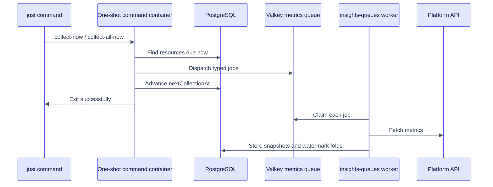

# Running collection for testing

Use the one-shot collection commands to test dispatch and worker behavior without editing the
production schedules in `configure.swift`.

## Before you run a collection

Start the complete local stack:

```console
just stack
```

The one-shot command dispatches jobs to the `metrics` queue. The persistent `insights-queues`
worker then executes them.



## Commands

| Command | What it selects | Database effect | Typical use |
|---|---|---|---|
| `just collect-now` | Only resources already satisfying `nextCollectionAt <= now` | Advances each successfully dispatched resource by `collectionIntervalDays` | Exercise the normal due-resource path |
| `just collect-all-now` | Every active resource | Sets every active resource due, dispatches it, then advances its next date | Force a complete local resource sweep |
| `just collect-accounts-now` | Every GitHub account | No resource due-date changes | Test the monthly follower collection immediately |

These commands use temporary Apple containers and remove them after dispatch completes. They
load secret-provider credentials from `.env`, local service settings from `.env.container`, and connect to
the already-running local PostgreSQL and Valkey containers.

### Run only resources that are due

```console
just collect-now
```

This is the safest production-like test. It may dispatch zero jobs when every resource has a
future `nextCollectionAt`.

### Force every resource to run

```console
just collect-all-now
```

This intentionally changes local scheduling state. Each active resource is first marked due;
after successful dispatch, its next date is recalculated from the current time. Do not use this
against a production database unless resetting every resource's cadence is intentional.

The command follows the normal platform routing table. GitHub and Hugging Face are active;
GHCR, npm, and PyPI remain outside the active dispatch routes.

### Run account metrics now

```console
just collect-accounts-now
```

This dispatches `SyncGitHubOrgStats` for every GitHub account once. The monthly schedule remains
unchanged, so there is nothing to restore afterward. Avoid repeatedly invoking it
because all jobs consume the same provider API allowance.

## Watch the work

The one-shot command exits after dispatching. Follow the persistent metrics worker to observe
the actual API calls and writes:

```console
container logs -f insights-queues
```

Useful supporting checks:

```console
container list
container logs -n 100 insights-queues
container logs -n 50 insights-scheduled
container exec insights-valkey valkey-cli ping
```

Inspect collection dates in the local database:

```console
container exec insights-db psql \
  -U vapor_username -d vapor_database \
  -c 'SELECT name, next_collection_at, collection_interval_days FROM resources ORDER BY name;'
```

Inspect metric watermarks:

```console
container exec insights-db psql \
  -U vapor_username -d vapor_database \
  -c 'SELECT resource_id, type, counted_through FROM metric_watermarks ORDER BY counted_through DESC;'
```

## What the watermark protects

All three commands use the same sync jobs as scheduled collection. GitHub clone and view jobs
therefore still call `Metric.foldDailyIntoAllTime`:

- completed days at or before `countedThrough` are skipped;
- the current incomplete UTC day is skipped;
- newly completed days advance the watermark;
- the PostgreSQL advisory lock protects concurrent folds for the same resource and metric.

Forcing a resource due changes **when it is fetched**, not **which days have already been
counted**. See [watermarks.md](watermarks.md) for the full explanation.

## Native and Compose equivalents

When running the application natively against local PostgreSQL and Valkey:

```console
swift run Insights collect-resources
swift run Insights collect-resources --force
swift run Insights collect-accounts
```

With Docker Compose, run the same application commands through the built image and shared
environment/network. A convenient future addition is dedicated one-shot Compose services,
mirroring the existing `migrate` service. Until those are added, use `docker compose run` with
the app service and override its command according to your Compose version.

## Troubleshooting

### The command dispatched zero resources

Run `just collect-all-now`, or inspect `next_collection_at`. `collect-now` deliberately selects
only due rows.

### Dispatch completed but no metrics appeared

Check that `insights-queues` is running, then read its logs. The one-shot container only enqueues;
the persistent worker performs the sync.

### A platform was skipped

Check `Collectors/SyncDispatch.swift` and the current matrix in
[queue-workers.md](queue-workers.md). A runnable job needs both registration and dispatch
routing.

### The all-time value did not increase

That can be correct. When a repeated rolling window contains no completed days newer than its
watermark, the stored total is already current.

#icicle-insights# #testing# #data-collection# #queues# #developer-documentation#
