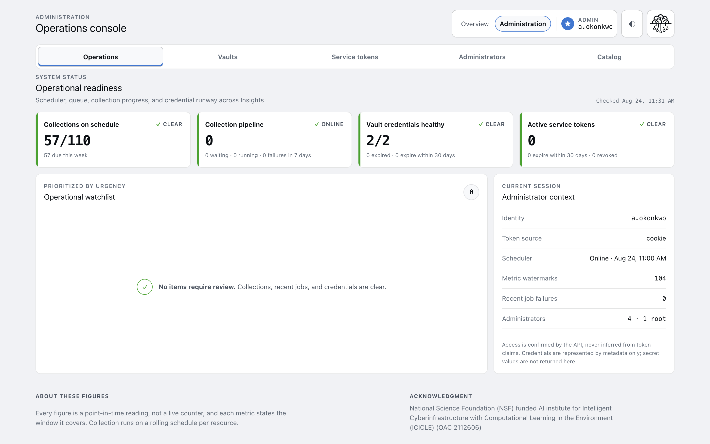
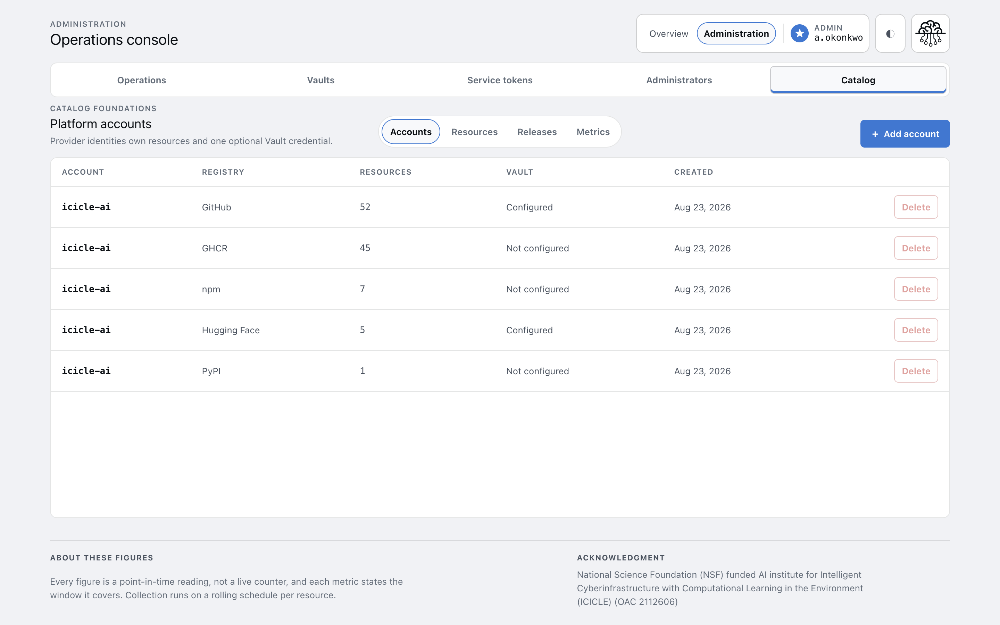
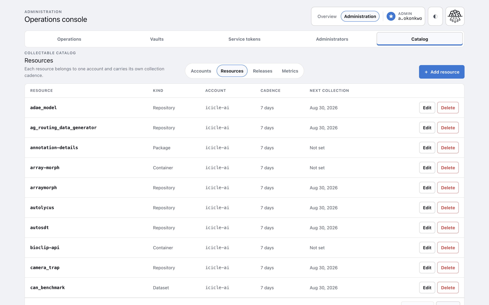
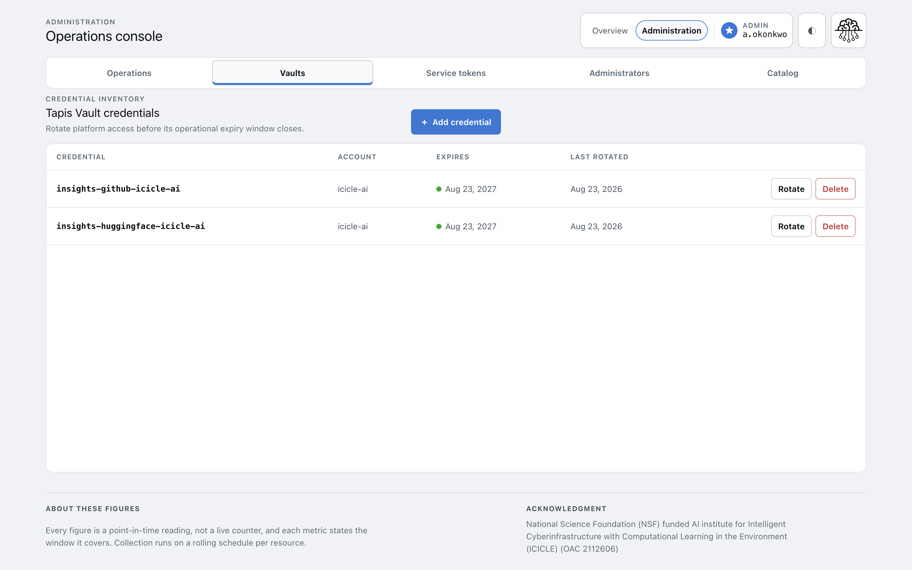
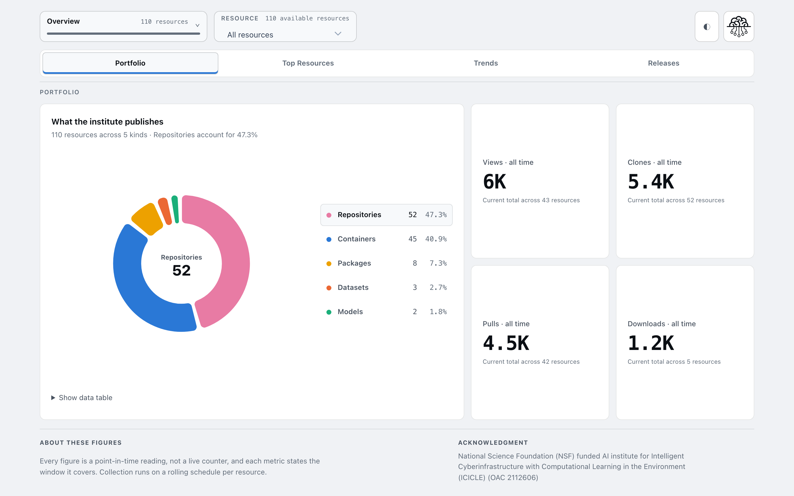

# Administering Insights

Your first hour with the console. For administrators.

By the end you will have read the operations screen, registered an account and a resource,
collected a metric on demand, and seen it appear on the dashboard.

You need administrator access. If you do not have it, start with
[Get admin access](../how-to/get-admin-access.md).

## 1. Find your way around

Open the dashboard and sign in.

The header has two modes. **Overview** is the public dashboard, which anyone can see.
**Administration** is the console, which only administrators see.

Select **Administration**.



You are on the Operations screen. Five tabs sit below the header: Operations, Vaults, Service
tokens, Administrators, Catalog.

## 2. Read the operations screen

This is the screen to check when something looks wrong. Four tiles across the top:

| Tile | Answers |
|---|---|
| Collections on schedule | Is anything overdue? |
| Collection pipeline | Is the scheduler running and the queue draining? |
| Vault credentials healthy | Is a platform credential about to expire? |
| Active service tokens | Is a deployment's token about to expire? |

All four should read **CLEAR** or **ONLINE**.

Look at **Administrator context** on the right. The **Scheduler** row shows a heartbeat timestamp.

That timestamp is the single most useful number on the screen. If it stops updating, collection has
stopped, and nothing else will tell you — a stopped scheduler fails silently.

The **Operational watchlist** below lists anything needing attention, most urgent first. Empty is
healthy.

## 3. Look at the catalog

Select **Catalog**.



Insights has a two-level model:

```
account  →  resource  →  metric history
```

An **account** is an identity on a platform, such as an organisation on GitHub. A **resource** is
something that account publishes: a repository, a model, a dataset, a package, a container.

Each account shows its registry, how many resources it owns, and whether a credential is
configured.

Select the **Resources** tab.



Every resource carries its own **cadence** — how often it is collected — and a **next collection**
date.

Note that cadence is mostly 7 days. The scheduler wakes hourly, but it only picks up resources whose
date has passed. Hourly scanning, weekly collecting.

## 4. Register an account

Suppose you want to track a new GitHub organisation.

1. On the **Accounts** tab, select **Add account**.
2. Enter the organisation name exactly as GitHub spells it.
3. Choose **GitHub** as the registry.
4. Save.

The registry decides which API collects for everything under this account.

## 5. Give it a credential

The platform will not report anything without a token.

1. Create a token on the platform, with read access to its metrics API and repositories.
2. Go to **Vaults** and select **Add credential**.
3. Choose the account, paste the token, and set an expiry matching the one on the platform.
4. Save.



Three fields, and no name among them — the credential name is generated from the account and its
registry, and previewed before you save.

The token goes to Tapis Vault. Only its name, account, and expiry are stored here, and the value is
never shown again — which is why this screen can list credentials without being able to reveal one.

Setting the expiry is what lets the Vault credentials tile warn you before collection breaks.

## 6. Add a resource

1. On the **Resources** tab, select **Add resource**.
2. Enter the repository name as GitHub spells it.
3. Choose the account you just made.
4. Choose kind **repository**.
5. Leave cadence at 7 days.
6. Save.

The resource is dispatched for collection immediately.

Seven days is the right default. GitHub keeps only 14 days of daily traffic history, so the form
will not let you go beyond that — collect less often and the days age out before anyone reads them.

## 7. Collect on demand

Rather than waiting, collect now.

```bash
just collect
```

This enqueues work for every resource that is due. A worker does the actual collecting, so watch it:

```bash
container logs -f queues
```

You will see the GitHub request and the rows written.

If it reports zero resources, nothing was due — that is a normal outcome, not an error.

## 8. See the result

Go back to **Overview**.



Your new resource is in the Portfolio counts. Select **Trends** to see change over time.

A brand-new resource has one reading, so its trend is a single point. Trends need a second sweep.

## What to remember

**The scheduler heartbeat is your health check.** Stale means collection stopped.

**Credentials expire, and that breaks a whole account at once.** The Vaults tile warns you first.

**Forcing a collection is safe.** It changes when a platform is asked, never what has already been
counted, so totals cannot be inflated by running it twice. That is what
[watermarks](../explanation/watermarks.md) are for.

**Cadence is not a promise.** It is the spacing booked after a successful collection.

## Next

| To | Read |
|---|---|
| Understand every screen | [Admin console](../reference/admin-console.md) |
| Let a service report its own metrics | [Issue a service token](../how-to/issue-a-service-token.md) |
| Work out why something stopped | [Diagnose a collection failure](../how-to/diagnose-a-collection-failure.md) |
| Stand up a new deployment | [Deploy Insights](../how-to/deploy-insights.md) |

#icicle-insights# #Tutorial# #Administrator# #console#
