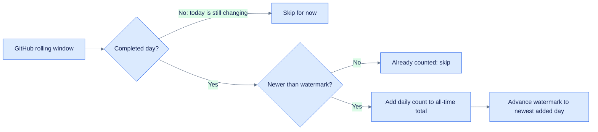
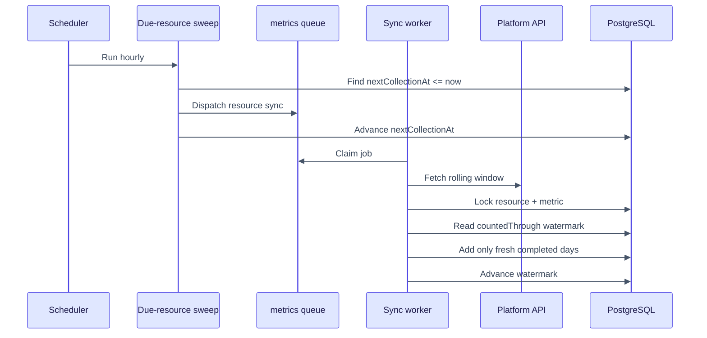

# Metric watermarks

A watermark is a bookmark that says: **“all completed data through this date has already been
counted.”**

It prevents overlapping API responses from inflating an all-time total.

## Why a bookmark is necessary

GitHub traffic endpoints return a rolling 14-day window. Imagine two collections:

```text
First response:   Jul 01  Jul 02  Jul 03  Jul 04
Second response:          Jul 02  Jul 03  Jul 04  Jul 05
```

Adding both response totals would count July 2–4 twice. Instead, Insights stores the newest
completed day already counted. After the first response, the watermark is July 4. When the
second response arrives, only July 5 is newer than the watermark, so only July 5 is added.



## Concrete example

Suppose clone counts arrive like this:

| Sweep | Days returned | Existing watermark | Days added | New watermark |
|---|---|---|---|---|
| Monday | Fri `3`, Sat `4`, Sun `5`, Mon `2` | none | Fri + Sat + Sun = `12` | Sunday |
| Tuesday | Sat `4`, Sun `5`, Mon `7`, Tue `1` | Sunday | Monday = `7` | Monday |
| Tuesday retry | same response | Monday | none | Monday |

Monday is excluded from Monday's sweep because the current UTC day is incomplete. It becomes
eligible on Tuesday. Tuesday is then held until Wednesday. A retry is harmless because nothing
newer than the watermark is added twice.

## Watermark versus schedule

These fields answer different questions:

| State | Question answered | Stored on |
|---|---|---|
| `Resource.nextCollectionAt` | When should this resource be fetched again? | Resource |
| `Resource.collectionIntervalDays` | How far apart should successful fetches be? | Resource |
| `MetricWatermark.countedThrough` | Which completed daily values are already included? | Resource + metric type |



Running a job immediately, changing its schedule, or adding more workers does not bypass the
watermark. The watermark logic runs inside `Metric.foldDailyIntoAllTime`, after the worker has
fetched the platform response.

## Which metrics use it?

| Metric shape | Example | Handling |
|---|---|---|
| Rolling window with daily values | GitHub clones and views | Fold days newer than the watermark |
| Provider reports a lifetime value | Hugging Face lifetime downloads | Replace with `setAllTime`; no watermark |
| Current snapshot | Stars, forks, likes, followers | Store the new reading; no watermark |
| Genuine non-overlapping delta | None currently | May use `addToAllTime` directly |

Watermarks are keyed by `(resource, metric type)`. Clone progress cannot accidentally advance
the views watermark, and one repository cannot affect another.

## Concurrency and retries

Multiple workers can finish overlapping sweeps concurrently. The fold takes a PostgreSQL
transaction-scoped advisory lock for the `(resource, metric type)` key before reading the
watermark and updating the total. That makes the read-check-add-advance sequence atomic for that
metric while allowing unrelated resources to proceed in parallel.

Queue delivery is still at-least-once: crashes and retries can execute a job again. The
watermark makes the daily fold idempotent with respect to already-counted days.

## Limits

A watermark prevents double-counting; it cannot recover data that the provider no longer
returns. If collection stops longer than GitHub's 14-day traffic window, missing days age out
and cannot be backfilled from that endpoint. That is why each platform bounds
`collectionIntervalDays` by its retention window.

See [collection.md](collection.md) for the complete metric model and
[queue-workers.md](queue-workers.md) for scheduling and worker operations.

#icicle-insights# #watermarks# #metrics# #data-integrity# #developer-documentation#
